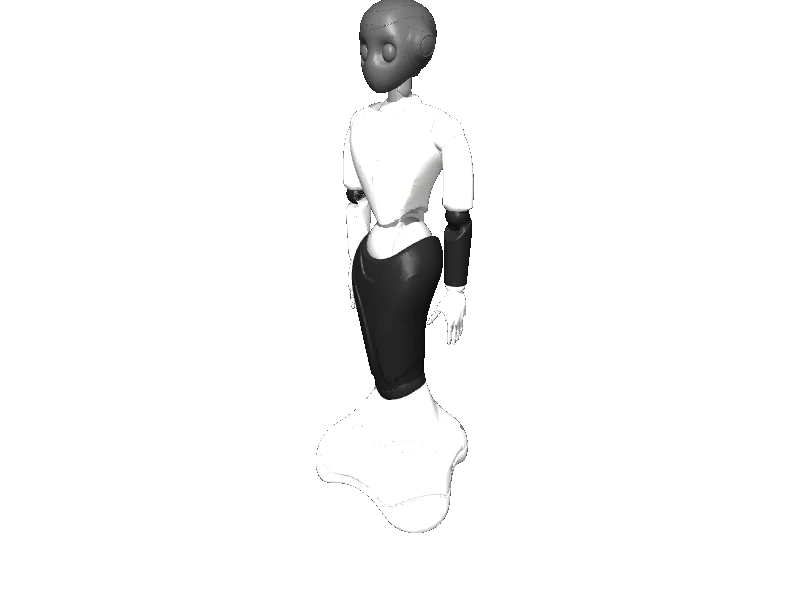

<!-- generated: docs/hooks/robot_pages.py -->

# ginger (mobile_manipulator URDF from robot_descriptions)

<p class="sr-chips"><span class="sr-chip sr-chip-family" data-family="mobile_manip">Mobile manipulators</span><span class="sr-chip">49 joints</span><span class="sr-chip sr-chip-sim">sim only</span></p>

A URDF from [Rayckey/GingerURDF](https://github.com/Rayckey/GingerURDF/tree/6a1307cd0ee2b77c82f8839cdce3a2e2eed2bd8f), compiled for MuJoCo by `strands_robots` on first use: 49 position actuators sized from the URDF effort limits, a free-floating base, a floor and a light. See [URDF robots](../learn/simulation/urdf.md).



The MJCF is compiled on your machine, so this page has no 3D view; the thumbnail is a local render.

```python
from strands_robots import Robot

robot = Robot("ginger")
```
