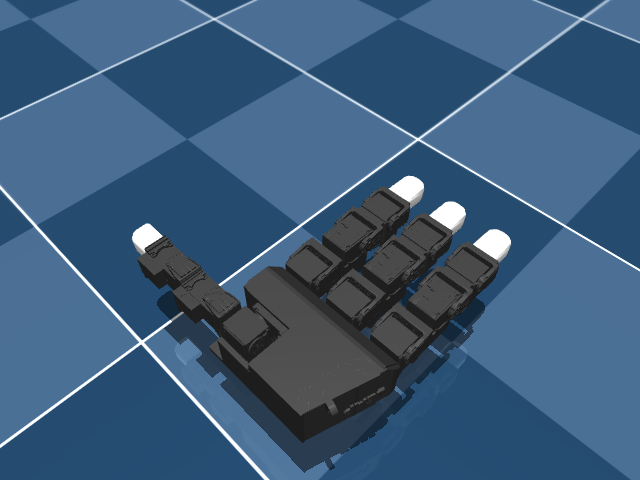
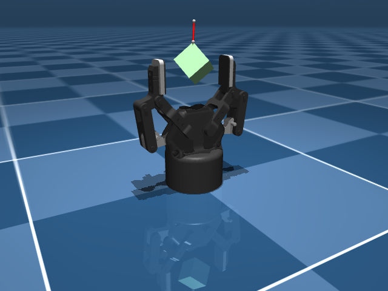

# Hands

Dexterous manipulation — fine motor control for grasping, in-hand manipulation.

---

| Robot | DOF | Notes |
|---|---|---|
| **Shadow Hand** | 24 | Gold standard for dexterous manipulation |
| **LEAP Hand** | 16 | Low-cost, 3D-printed |
| **Robotiq 2F-85** | 1 | Industrial parallel gripper |

---


<div class="robot-gallery" markdown>
<figure markdown>
  { width="240" }
  <figcaption><b>Leap Hand</b><br>LEAP Hand (16-DOF dexterous)</figcaption>
</figure>
<figure markdown>
  { width="240" }
  <figcaption><b>Robotiq 2F85</b><br>Robotiq 2F-85 Gripper (2-finger adaptive)</figcaption>
</figure>
<figure markdown>
  { width="240" }
  <figcaption><b>Shadow Hand</b><br>Shadow Dexterous Hand (24-DOF)</figcaption>
</figure>
</div>

## Example

```python
from strands_robots import Robot

hand = Robot("shadow_hand")
obs = hand.get_observation()
print(f"Finger positions: {obs['joint_positions']}")
```
