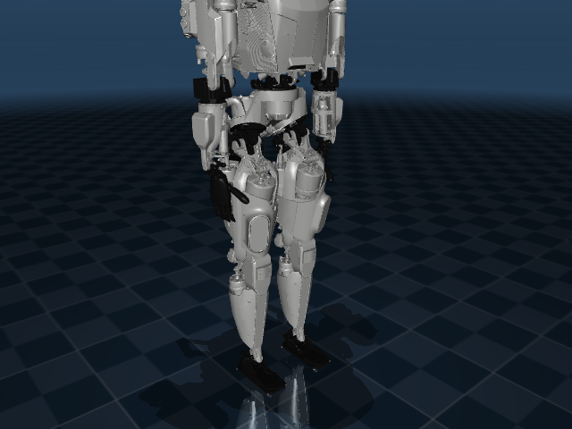
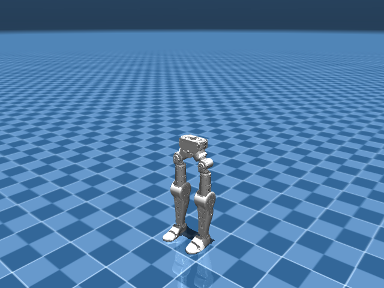
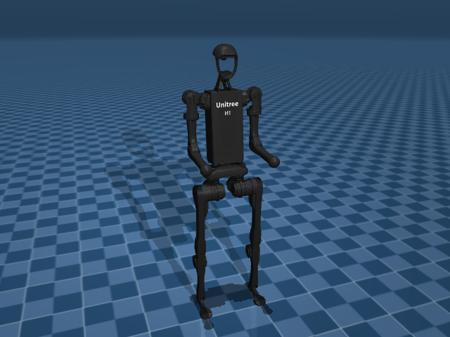

# Humanoids

Full-body robots with arms, legs, and sometimes hands.

---

| Robot | DOF | Notes |
|---|---|---|
| **Fourier N1** | 26 | Bimanual humanoid (GR-1). Dexterous hands. |
| **Unitree G1** | 29 | Compact humanoid. Arms + dexterous hands. |
| **Unitree H1** | 19 | Taller Unitree humanoid. |
| **Apptronik Apollo** | 34 | Full-size humanoid for logistics. |
| **Cassie** | 14 | Agility Robotics. Bipedal locomotion. |
| **Reachy 2** | 21 | Pollen Robotics full humanoid. |
| **Asimov V0** | 12 | Bipedal legs (+ 2 passive toes). |
| **Open Duck Mini** | 16 | Expressive biped. Feetech servos. |

---


<div class="robot-gallery" markdown>
<figure markdown>
  { width="240" }
  <figcaption><b>Apollo</b><br>Apptronik Apollo Humanoid (34-DOF)</figcaption>
</figure>
<figure markdown>
  { width="240" }
  <figcaption><b>Asimov V0</b><br>Asimov V0 Bipedal Legs (12-DOF + 2 passive toes)</figcaption>
</figure>
<figure markdown>
  { width="240" }
  <figcaption><b>Cassie</b><br>Agility Cassie Bipedal Robot</figcaption>
</figure>
<figure markdown>
  { width="240" }
  <figcaption><b>Fourier N1</b><br>Fourier N1 / GR-1 Humanoid (26-DOF)</figcaption>
</figure>
<figure markdown>
  { width="240" }
  <figcaption><b>Open Duck Mini</b><br>Open Duck Mini V2 (16-DOF expressive biped, Feetec</figcaption>
</figure>
<figure markdown>
  { width="240" }
  <figcaption><b>Unitree G1</b><br>Unitree G1 Humanoid (29-DOF + dexterous hands)</figcaption>
</figure>
<figure markdown>
  { width="240" }
  <figcaption><b>Unitree H1</b><br>Unitree H1 Humanoid (19-DOF)</figcaption>
</figure>
</div>

## Example

```python
from strands import Agent
from strands_robots import Robot

robot = Robot("unitree_g1")
agent = Agent(tools=[robot])
agent("Walk forward 2 meters, then pick up the box")
```

!!! note "Whole-Body Control"
    Humanoids benefit from the `gear_sonic` policy provider for whole-body coordination at 135Hz.
