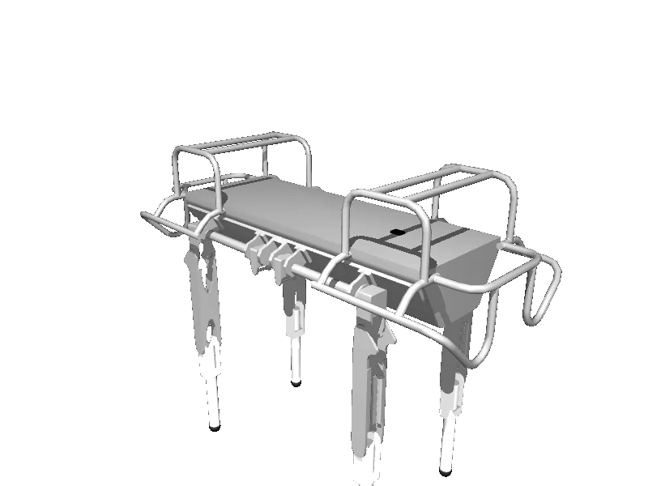

<!-- generated: docs/hooks/robot_pages.py -->

# hyq (quadruped URDF from robot_descriptions)

<p class="sr-chips"><span class="sr-chip sr-chip-family" data-family="mobile">Mobile bases</span><span class="sr-chip">12 joints</span><span class="sr-chip sr-chip-sim">sim only</span></p>

A URDF from [Gepetto/example-robot-data](https://github.com/Gepetto/example-robot-data/tree/d0d9098d752014aec3725b07766962acf06c5418), compiled for MuJoCo by `strands_robots` on first use: 12 position actuators sized from the URDF effort limits, a free-floating base, a floor and a light. See [URDF robots](../learn/simulation/urdf.md).



The MJCF is compiled on your machine, so this page has no 3D view; the thumbnail is a local render.

```python
from strands_robots import Robot

robot = Robot("hyq")
```
