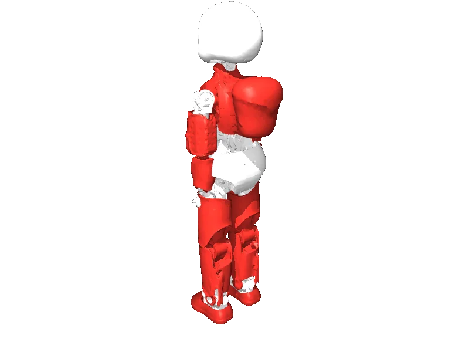

<!-- generated: docs/hooks/robot_pages.py -->

# icub (humanoid URDF from robot_descriptions)

<p class="sr-chips"><span class="sr-chip sr-chip-family" data-family="humanoid">Humanoids</span><span class="sr-chip">32 joints</span><span class="sr-chip sr-chip-sim">sim only</span></p>

URDF from [robotology/icub-models@v1.25.0](https://github.com/robotology/icub-models/tree/v1.25.0), [compiled for MuJoCo](../learn/simulation/urdf.md) on first use: 32 position actuators, floating base.



```python
from strands_robots import Robot

robot = Robot("icub")
```

## Policies verified on this robot

No checkpoint verified on this robot yet. Record one: [Record](../learn/data/record.md), then [train](../learn/training/lerobot.md) and run it with `run_policy`.
