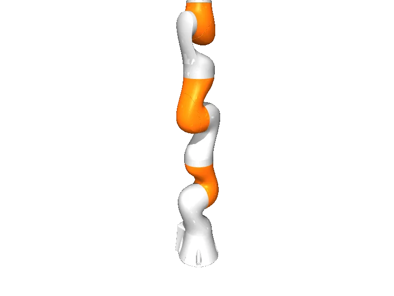

<!-- generated: docs/hooks/robot_pages.py -->

# iiwa7 (arm URDF from robot_descriptions)

{{robot_chips:iiwa7}}

URDF from [facebookresearch/differentiable-robot-model@d7bd1b3](https://github.com/facebookresearch/differentiable-robot-model/tree/d7bd1b3b8ef1d6dabe9b68474a622185c510e112), [compiled for MuJoCo](../learn/simulation/urdf.md) on first use: 7 position actuators, fixed base.



```python
from strands_robots import Robot

robot = Robot("iiwa7")
```

## Policies verified on this robot

No checkpoint verified on this robot yet. Record one: [Record](../learn/data/record.md), then [train](../learn/training/lerobot.md) and run it with `run_policy`.
