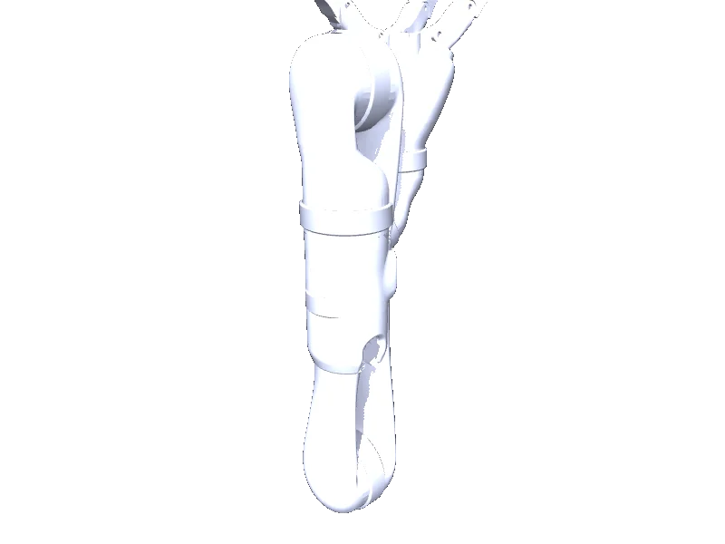

<!-- generated: docs/hooks/robot_pages.py -->

# j2n6s300 (arm URDF from robot_descriptions)

<p class="sr-chips"><span class="sr-chip sr-chip-family" data-family="arm">Arms</span><span class="sr-chip">12 joints</span><span class="sr-chip sr-chip-sim">sim only</span></p>

URDF from [Kinovarobotics/kinova-ros@924781d](https://github.com/Kinovarobotics/kinova-ros/tree/924781d3dfe241b2b94b3c72a804b80d3658cf02), [compiled for MuJoCo](../learn/simulation/urdf.md) on first use: 12 position actuators, fixed base.



```python
from strands_robots import Robot

robot = Robot("j2n6s300")
```
