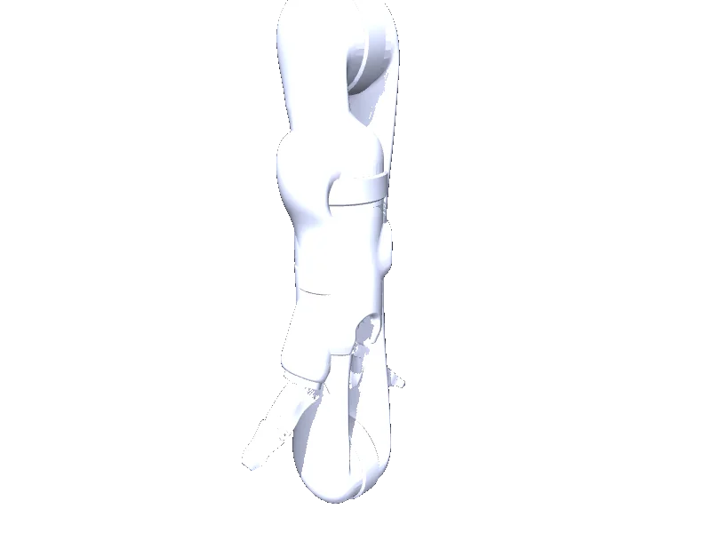

<!-- generated: docs/hooks/robot_pages.py -->

# j2s6s200 (arm URDF from robot_descriptions)

<p class="sr-chips"><span class="sr-chip sr-chip-family" data-family="arm">Arms</span><span class="sr-chip">10 joints</span><span class="sr-chip sr-chip-sim">sim only</span></p>

A URDF from [Kinovarobotics/kinova-ros](https://github.com/Kinovarobotics/kinova-ros/tree/924781d3dfe241b2b94b3c72a804b80d3658cf02), compiled for MuJoCo by `strands_robots` on first use: 10 position actuators sized from the URDF effort limits, a fixed base, a floor and a light. See [URDF robots](../learn/simulation/urdf.md).



The MJCF is compiled on your machine, so this page has no 3D view; the thumbnail is a local render.

```python
from strands_robots import Robot

robot = Robot("j2s6s200")
```
