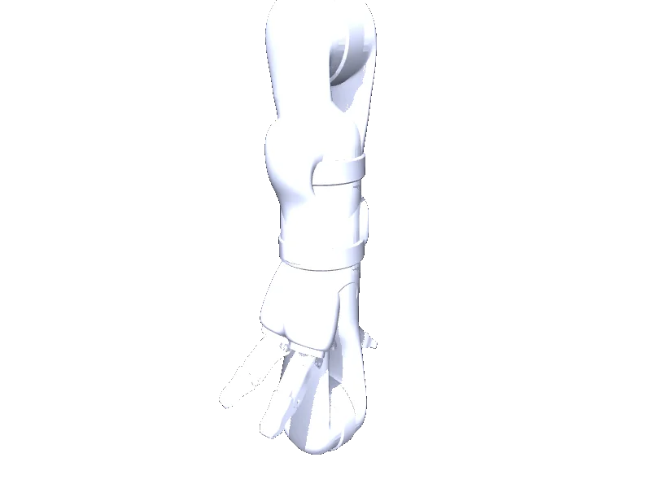

<!-- generated: docs/hooks/robot_pages.py -->

# j2s7s300 (arm URDF from robot_descriptions)

{{robot_chips:j2s7s300}}

URDF from [Kinovarobotics/kinova-ros@924781d](https://github.com/Kinovarobotics/kinova-ros/tree/924781d3dfe241b2b94b3c72a804b80d3658cf02), [compiled for MuJoCo](../learn/simulation/urdf.md) on first use: 13 position actuators, fixed base.



```python title="sketch"
from strands_robots import Robot

robot = Robot("j2s7s300")  # clones the description and compiles the URDF on first use
print(robot.robot_joint_names("j2s7s300"))
robot.cleanup()
```

Add a cube and a camera ([worlds and objects](../learn/simulation/worlds-and-objects.md)), then run a checkpoint on it ([same checkpoint](../start/first-policy.md)).

## Policies verified on this robot

No checkpoint verified on this robot yet. Record one: [Record](../learn/data/record.md), then [train](../learn/training/lerobot.md) and run it with `run_policy`.
