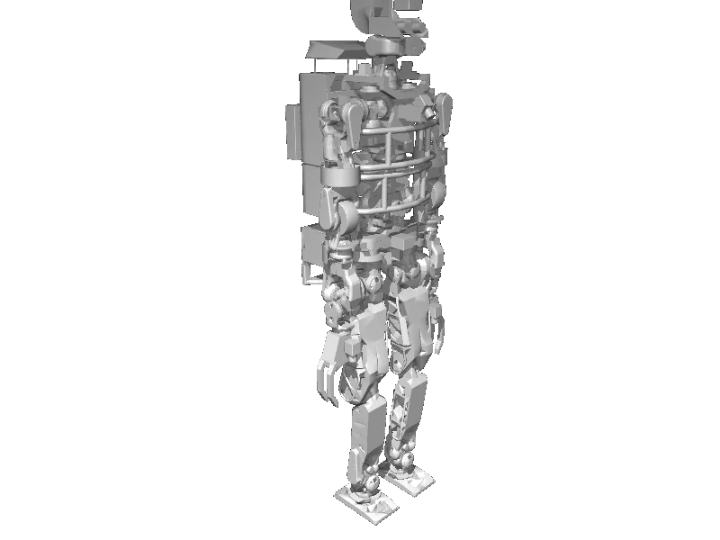

<!-- generated: docs/hooks/robot_pages.py -->

# jaxon (humanoid URDF from robot_descriptions)

<p class="sr-chips"><span class="sr-chip sr-chip-family" data-family="humanoid">Humanoids</span><span class="sr-chip">38 joints</span><span class="sr-chip sr-chip-sim">sim only</span></p>

URDF from [robot-descriptions/jaxon_description@4a0cb7a](https://github.com/robot-descriptions/jaxon_description/tree/4a0cb7a4a737864312f8d6e3f89823a741539bfc), [compiled for MuJoCo](../learn/simulation/urdf.md) on first use: 38 position actuators, floating base.



```python
from strands_robots import Robot

robot = Robot("jaxon")
```
