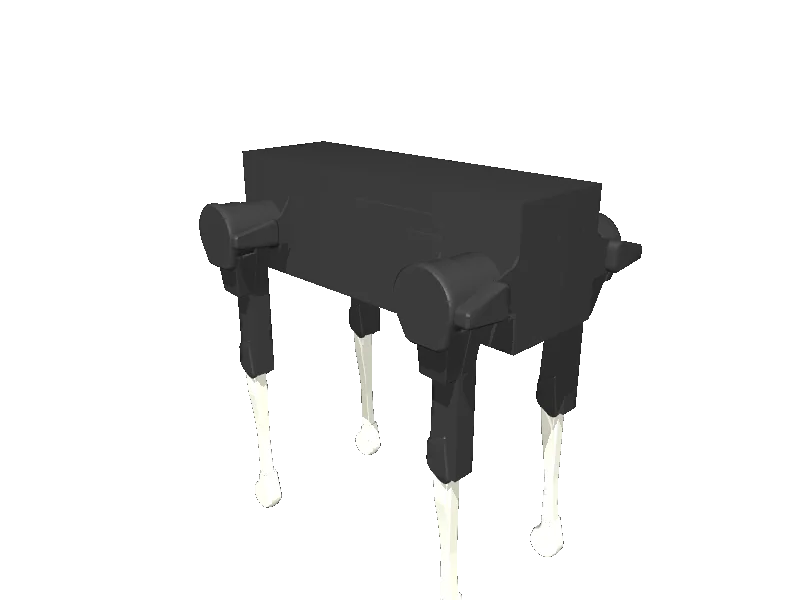

<!-- generated: docs/hooks/robot_pages.py -->

# laikago (quadruped URDF from robot_descriptions)

{{robot_chips:laikago}}

URDF from [unitreerobotics/unitree_mujoco@f3300ff](https://github.com/unitreerobotics/unitree_mujoco/tree/f3300ff1bf0ab9efbea0162717353480d9b05d73), [compiled for MuJoCo](../learn/simulation/urdf.md) on first use: 12 position actuators, floating base.



```python title="sketch"
from strands_robots import Robot

robot = Robot("laikago")  # clones the description and compiles the URDF on first use
print(robot.robot_joint_names("laikago"))
robot.cleanup()
```

Command it as a velocity setpoint stream, or train a gait in batch ([rl](../learn/policies/rl.md)).

## Policies verified on this robot

No checkpoint verified on this robot yet. Record one: [Record](../learn/data/record.md), then [train](../learn/training/lerobot.md) and run it with `run_policy`.
