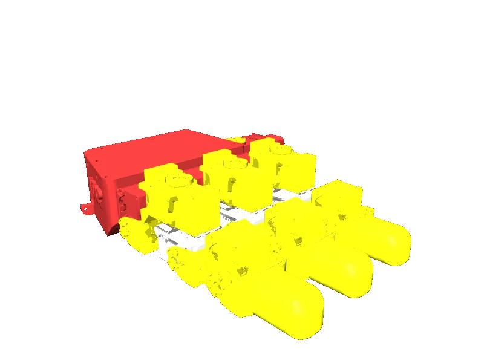

<!-- generated: docs/hooks/robot_pages.py -->

# leap_hand_v1 (end_effector URDF from robot_descriptions)

<p class="sr-chips"><span class="sr-chip sr-chip-family" data-family="hand">Hands and grippers</span><span class="sr-chip">16 joints</span><span class="sr-chip sr-chip-sim">sim only</span></p>

URDF from [leap-hand/LEAP_Hand_Sim@150bc3d](https://github.com/leap-hand/LEAP_Hand_Sim/tree/150bc3d4b61fd6619193ba5a8ef209f3609ced89), [compiled for MuJoCo](../learn/simulation/urdf.md) on first use: 16 position actuators, fixed base.



```python
from strands_robots import Robot

robot = Robot("leap_hand_v1")
```
