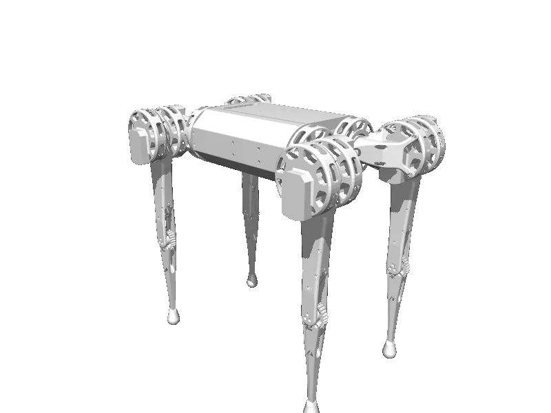

<!-- generated: docs/hooks/robot_pages.py -->

# mini_cheetah (quadruped URDF from robot_descriptions)

{{robot_chips:mini_cheetah}}

URDF from [Derek-TH-Wang/mini_cheetah_urdf@1988bce](https://github.com/Derek-TH-Wang/mini_cheetah_urdf/tree/1988bceb26e81f28594a16e7d5e6abe5cbb27ace), [compiled for MuJoCo](../learn/simulation/urdf.md) on first use: 12 position actuators, floating base.



```python title="sketch"
from strands_robots import Robot

robot = Robot("mini_cheetah")  # clones the description and compiles the URDF on first use
print(robot.robot_action_keys("mini_cheetah"))
robot.cleanup()
```

Command it as a velocity setpoint stream, or train a gait in batch ([rl](../learn/policies/rl.md)).

## Policies verified on this robot

No checkpoint verified on this robot yet. Record one: [Record](../learn/data/record.md), then [train](../learn/training/lerobot.md) and run it with `run_policy`.
