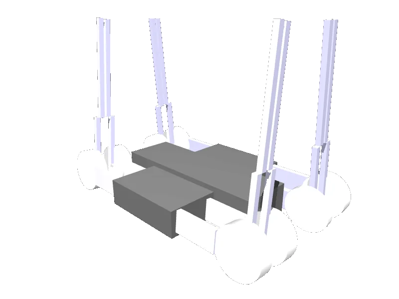

<!-- generated: docs/hooks/robot_pages.py -->

# minitaur (quadruped URDF from robot_descriptions)

<p class="sr-chips"><span class="sr-chip sr-chip-family" data-family="mobile">Mobile bases</span><span class="sr-chip">16 joints</span><span class="sr-chip sr-chip-sim">sim only</span></p>

URDF from [bulletphysics/bullet3@7dee343](https://github.com/bulletphysics/bullet3/tree/7dee3436e747958e7088dfdcea0e4ae031ce619e), [compiled for MuJoCo](../learn/simulation/urdf.md) on first use: 16 position actuators, floating base.



```python
from strands_robots import Robot

robot = Robot("minitaur")
```
