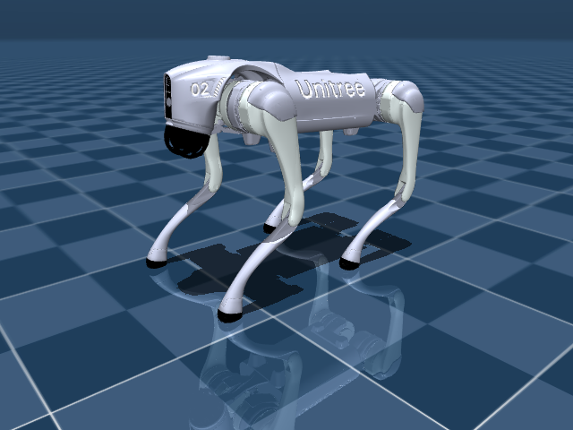

# Mobile Robots

Robots that move through the world — quadrupeds, wheeled platforms, mobile manipulators.

---

| Robot | Type | Notes |
|---|---|---|
| **Unitree Go2** | Quadruped | Consumer-grade. Agile locomotion. |
| **Unitree A1** | Quadruped | Research-grade quadruped. |
| **Spot** | Quadruped | Boston Dynamics. Industrial inspection. With arm. |
| **Stretch 3** | Mobile manipulator | Hello Robot. Home assistance. |
| **LeKiwi** | Wheeled base | LeRobot's mobile platform. |
| **EarthRover** | Wheeled | Outdoor navigation platform. |
| **Google Robot** | Mobile manipulator | Google DeepMind. Mobile base + arm (RT-X). |

---


<div class="robot-gallery" markdown>
<figure markdown>
  { width="240" }
  <figcaption><b>Spot</b><br>Boston Dynamics Spot (with arm)</figcaption>
</figure>
<figure markdown>
  { width="240" }
  <figcaption><b>Stretch3</b><br>Hello Robot Stretch 3 (mobile manipulator)</figcaption>
</figure>
<figure markdown>
  { width="240" }
  <figcaption><b>Unitree Go2</b><br>Unitree Go2 Quadruped</figcaption>
</figure>
</div>

## Example

```python
from strands import Agent
from strands_robots import Robot

robot = Robot("spot")
agent = Agent(tools=[robot])
agent("Walk to the door and inspect the gauge on the wall")
```
