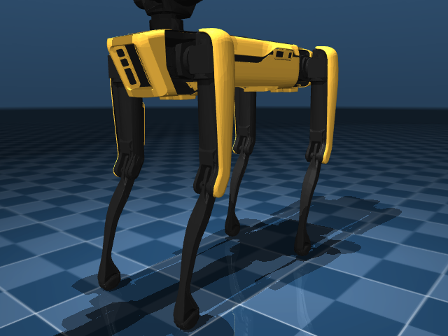

# Mobile, mobile manip, and aerial

Quadrupeds, wheeled bases, mobile manipulators, and quadcopters.

```python
from strands_robots import Robot
sim = Robot("unitree_go2")      # Unitree Go2 quadruped
sim = Robot("spot")             # Boston Dynamics Spot
sim = Robot("stretch3")         # Hello Robot Stretch 3 (mobile manip)
sim = Robot("crazyflie")        # Bitcraze Crazyflie 2 quadcopter
```

## Catalog

| Name | Description | Joints | Aliases |
|------|-------------|-------:|---------|
| `aliengo` | Unitree Aliengo Quadruped (12-DOF) | 13 | `unitree_aliengo` |
| `anymal_b` | ANYbotics ANYmal B Quadruped (12-DOF) | 13 | `anybotics_anymal_b` |
| `anymal_c` | ANYbotics ANYmal C Quadruped (12-DOF) | 13 | `anybotics_anymal_c` |
| `crazyflie` | Bitcraze Crazyflie 2 Nano-Quadcopter | 1 | `cf2`, `bitcraze_crazyflie` |
| `earthrover` | EarthRover Mini Plus (mobile outdoor navigation) _(hardware-only, no sim asset)_ | ? | `earth_rover`, `earthrover_mini_plus`, `frodobots` |
| `go1` | Unitree Go1 Quadruped (12-DOF) | 13 | `unitree_go1` |
| `google_robot` | Google Robot (mobile base + arm, RT-X) | 10 | `oxe_google` |
| `lekiwi` | LeKiwi mobile manipulator (6-DOF arm on 3-omniwheel base, 9 actuators) | 9 | - |
| `lekiwi_client` | LeKiwi networked client (drives a remote LeKiwi host over ZMQ) _(hardware-only, no sim asset)_ | ? | `lekiwi_remote`, `lekiwi_net` |
| `robot_soccer_kit` | Robot Soccer Kit (multi-robot soccer, 65-DOF total) | 65 | `rsk` |
| `skydio_x2` | Skydio X2 Autonomous Drone | 1 | - |
| `spot` | Boston Dynamics Spot (with arm) | 20 | `boston_dynamics_spot` |
| `stretch` | Hello Robot Stretch (original, mobile manipulator) | 18 | `hello_robot_stretch_original` |
| `stretch3` | Hello Robot Stretch 3 (mobile manipulator) | 41 | `hello_robot_stretch`, `hello_robot_stretch_3` |
| `tiago_dual` | PAL Robotics TIAGo++ Dual-Arm Mobile (26-DOF) | 26 | `tiago++`, `pal_tiago_dual` |
| `unitree_a1` | Unitree A1 Quadruped | 13 | `a1` |
| `unitree_go2` | Unitree Go2 Quadruped | 40 | `go2` |

## Flying a real Crazyflie

`crazyflie` declares `hardware.driver = "strands"`, so `mode="real"` builds the native
CRTP driver over a [Crazyradio](https://www.bitcraze.io/products/crazyradio-2-0/) dongle.
lerobot has no robot type for a Crazyflie, so this is the only way to fly one from here.

```python
from strands_robots import Robot

cf = Robot("crazyflie", mode="real", port="radio://0/80/2M/E7E7E7E7E7")
cf.connect_eagerly()          # opens the link, ARMS the platform, starts telemetry

cf.takeoff(height=0.5, duration=2.0)
cf.set_twist(vx=0.2, wz=1.0, z=0.5)   # 0.2 m/s forward, 1.0 rad/s yaw, holding 0.5 m
cf.land()                              # descends under control
cf.cleanup()
```

Install the client library with the `crazyflie` extra: `pip install "strands-robots[crazyflie]"`.

Three things behave differently from a ground robot, and each one is a way to break the
aircraft if you assume otherwise:

| | What to know |
|---|---|
| **Units** | `wz` is **rad/s**, as everywhere else in this package. `cflib` wants deg/s, and the driver is the only place that conversion happens. |
| **Setpoints are a stream** | The firmware supervisor cuts thrust when the setpoint stream goes quiet, so one `send_action` latches a setpoint and a background repeater keeps it alive at `setpoint_hz` (default 20 Hz). It returns when the setpoint is latched, not when the motion is done. |
| **`stop` lands** | `stop()` / `stop_task()` / `cleanup()` all perform a controlled descent. Cutting the motors - an airborne aircraft *falls* - is the separately named `emergency_stop()`, and the agent tool schema cannot reach it. |

The flight envelope is the driver's, not the SDK's: `cflib` imposes no ceiling and the
firmware attempts whatever arrives. A setpoint outside it is **refused by name**, never
clamped, so a caller who asked for 5 m/s never silently flies 1 m/s. Read the bounds with
`strands_robots.drivers.crazyflie.twist_envelope()`.

Commands go through `send_action` / `set_twist` / `takeoff` / `land`; `start_task` and
`run_policy` refuse, because this package registers no aerial policy provider and a
quadcopter has no joints for a manipulation policy's action to land on. Telemetry
(`stateEstimate` position, `stabilizer` attitude, `pm.vbat`) is cached for the mesh; a bare
Crazyflie has no ranger deck, so no lidar topic is published.

## Featured renders

### `spot`

{ width=400 }

_Boston Dynamics Spot (with arm)_

### `stretch3`

{ width=400 }

_Hello Robot Stretch 3 (mobile manipulator)_

### `unitree_go2`

{ width=400 }

_Unitree Go2 Quadruped_

## See also

- [Humanoids](humanoids.md) - bipedal alternatives.
- [Multi-robot mesh](../mesh.md) - coordinate a fleet via the mesh.
- [Domain randomization](../simulation/domain-randomization.md) - terrain randomisation for legged robots.
