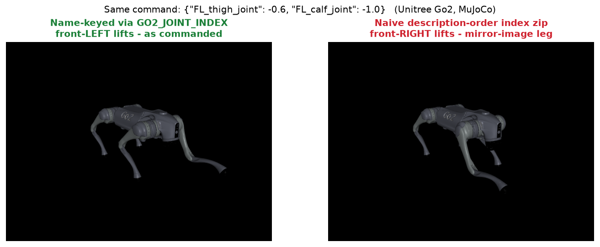

# Mobile

Quadrupeds and wheeled bases. Two of them drive for real from here through a
native driver.

```python
from strands_robots import Robot
sim = Robot("unitree_go2")      # Unitree Go2 quadruped
sim = Robot("spot")             # Boston Dynamics Spot
sim = Robot("earthrover")       # FrodoBots EarthRover
```

## Catalog

Every robot in this family, generated from `robots.json` at build time. Renders are MuJoCo sim renders, never hardware photos.

{{robot_cards:mobile}}

## Real hardware: the Go2 native driver

The Go2 has no lerobot robot type, so `mode="real"` builds the native CycloneDDS
driver in `strands_robots.drivers.go2`. Its registry entry declares
`hardware.driver = "strands"`, so no `driver=` keyword is needed:

```python
from strands_robots import Robot

go2 = Robot("go2", mode="real", port="192.168.123.161", network_interface="eth0")
go2.connect_eagerly()          # subscribes rt/lowstate and rt/sportmodestate
go2.release_sport_mode()       # hands the legs over - see below
go2.send_action({"FL_calf_joint": -1.5})
```

The driver talks CycloneDDS through `unitree_sdk2py`, a vendor SDK that is not
an extra of this project; the install recipe per platform is in
[Installing the Unitree SDK](humanoids.md#installing-the-unitree-sdk), and a
missing SDK is refused with that recipe rather than only its module name.

**Sport mode must be released first.** The Go2 ships with an onboard sport-mode
service driving the legs. Until it is released, a `rt/lowcmd` frame puts that
controller and your commands on the same twelve motors, so every write path
(`send_action`, `run_policy`, `start_task`) refuses until `release_sport_mode()`
confirms the robot reports no active mode. Releasing is deliberately *not* a side
effect of `connect_eagerly()`, which only subscribes to read. The release is
asynchronous, so `release_sport_mode(attempts=N)` polls: N release-then-verify
rounds, each release followed by the `CheckMode()` read that confirms it, and a
refusal names the mode that last read reported.

The gate follows the last reading, not the first success: the write path reads a
cached verdict so it stays usable at 500 Hz and nothing else re-asks the robot, so
a Go2 that re-enters a motion mode - the app, a fall-recovery, an operator's
remote - is only noticed by the next `release_sport_mode()`, which shuts the gate
again. `send_action` then refuses, naming that mode, until a release confirms an
empty one.

**Actions are keyed by joint name, never by index.** `rt/lowcmd`'s `motor_cmd`
array follows Unitree's `LegID` order - front-right, front-left, rear-right,
rear-left - while the Go2's own URDF/MJCF description declares its joints
front-left, front-right, rear-left, rear-right. The two orders hold the same
twelve joints, so zipping a description-ordered vector onto `motor_cmd` produces
twelve valid commands aimed at the mirror-image legs, with a correct CRC and
nothing in any log to say so. `GO2_JOINT_INDEX` is the one place the two
conventions are reconciled:



_The same command, run in MuJoCo on the official Go2 description. Left: keyed by
name through `GO2_JOINT_INDEX`, the front-left leg lifts. Right: the identical
twelve-value vector written to `motor_cmd` in description order - the front-right
leg lifts instead._

| Description order (URDF/MJCF) | Wire slot (`motor_cmd` index) |
|-------------------------------|------------------------------:|
| `FL_hip_joint` / `_thigh_` / `_calf_` | 3, 4, 5 |
| `FR_hip_joint` / `_thigh_` / `_calf_` | 0, 1, 2 |
| `RL_hip_joint` / `_thigh_` / `_calf_` | 9, 10, 11 |
| `RR_hip_joint` / `_thigh_` / `_calf_` | 6, 7, 8 |

Telemetry read back through `go2.state` is keyed by the same names, so the read
path cannot be transposed either.

`run_policy(policy_object=...)` rolls a callable or a `Policy` on a 500 Hz thread,
re-checks both gates every step, and publishes a zero-gain (but still enabled)
soft-stop frame on the way out rather than cutting the motors dead. Poll
`get_task_status()`; `stop_task()` reports honestly whether the loop actually
joined.

`get_task_status()` keeps answering after the rollout's thread is gone, so a caller
who polls late still learns why the robot stopped moving:

| `exit_reason` | What happened |
|---------------|---------------|
| `n_steps` / `duration` | the rollout ran its budget out |
| `gate` | sport mode was taken back, or the battery fell under the floor (`exit_detail` says which) |
| `policy` | the policy raised, returned `None`, or named a joint this robot does not have |
| `publish` | the frame did not reach `rt/lowcmd` |
| `stop_task` / `stop` / `cleanup` | a caller halted it — `stop_task()`, the mesh's `stop` verb, or teardown |

## Real hardware: the EarthRover native driver

`earthrover` declares `hardware.lerobot_type`, so `mode="real"` builds the lerobot robot
by default; `driver="strands"` selects the native driver instead. That driver talks to the
vendor's [earth-rovers-sdk](https://github.com/frodobots-org/earth-rovers-sdk) over HTTP,
which proxies to the rover, and `port=` is that SDK's base URL.

That transport is `requests`, from `pip install 'strands-robots[earthrover]'` (a member of
`[all]`). Without it the driver still registers, and `connect_eagerly()` returns a reason
naming the extra rather than raising.

```python
from strands_robots import Robot

rover = Robot("earthrover", mode="real", driver="strands", port="http://10.0.0.9:8000")
if (reason := rover.connect_eagerly()) is not None:   # proves GET /data answers
    raise SystemExit(reason)

rover.send_action({"linear": 0.4, "angular": -0.2})    # each axis normalised to [-1, 1]
rover.cleanup()                                        # sends a parting zero twist
```

The driver *is* the agent's tool, so an agent gets the rover's whole surface by holding it:

```python
from strands import Agent

Agent(tools=[rover])("drive forward for two seconds, then show me the front camera")
```

| `action` | Parameters | Does |
|---|---|---|
| `sensors` | - | Telemetry snapshot: a one-line summary block plus the whole `/data` JSON. Refuses when the SDK has never answered, rather than reporting an empty rover. |
| `status` | - | Connection state, the SDK URL and the last commanded twist. |
| `camera` | `camera` (`front`/`rear`) | One frame, as an image block the model can see. |
| `move` | `linear`, `angular`, `duration_s` | One twist. With `duration_s` (at most 30 s) the twist is held and a zero twist follows; the answer reports both halves, so a lost trailing stop is an error and not a completed move. |
| `lamp` | `on` | Switches the headlamp - and stops, because the SDK carries `lamp` inside the one `/control` twist frame. |
| `speak` | `text` | Says `text` through the rover's speaker. |
| `stop` | - | A zero twist, and the envelope says whether it reached the SDK. |

An `action` outside that enum is refused naming the declared verbs, never dispatched onto
the halt. Writes are judged on the driver's own write path, so `move` and `send_action` are
refused by the same sentence.

Both axes are a fraction of full speed, so `1.0` is the fastest value there is and a
magnitude above it is **refused by name**, never clamped - as on the
[Crazyflie](aerial.md), and for a reason the rover makes sharper: it is velocity-commanded,
so a twist it was not asked for keeps running until the next command. `lamp` is read as a
boolean rather than for truthiness, so `lamp="off"` is refused instead of switching the
headlamp on.

The `sensors` summary reads the lamp the same way. The SDK carries the field as the `1`/`0`
that a `lamp` write puts on the wire, so those integers and the two booleans are the
readings; anything else - a firmware that no longer carries `lamp`, or one that spells it
`"off"` - reads `?`, like every other field the snapshot does not carry. The whole `/data`
block sits beside the summary, so a caller that wants the raw field still reads it.

Every endpoint - including `POST /control`, which *drives* - is built from that one
string, so it has to address the host you wrote. A value whose authority names one host and
resolves to another is refused at construction: `requests` reports only the host it ended up
with, and `connect_eagerly()` reports success whenever something answers there.

| `port=` | Result |
|---|---|
| omitted, `http://10.0.0.9:8000`, `10.0.0.9:8000`, `https://rover.local:8000` | Accepted. A bare `host:port` is prefixed with `http://`. |
| `HTTP://10.0.0.9:8000`, `http://[::1]:8000`, `10.0.0.9:8000/rover-7` | Accepted - the scheme is case-insensitive, an IPv6 literal keeps its brackets, and a path prefix survives for an SDK behind a reverse proxy. |
| `bot.local@10.0.0.9:8000` | **Refused.** Everything before the `@` is userinfo, so `10.0.0.9` is dialled while the address still reads as `bot.local`. |
| `ws://10.0.0.9:8000` | **Refused.** The SDK is plain HTTP; left alone, `ws` becomes the host and the port you wrote is discarded. |
| `/tmp/rover.sock` | **Refused** - that shape belongs to the serial arms. |

A URL that cannot be used at all - `http://`, an out-of-range port, an embedded space -
is left to `requests`, which already names it; `connect_eagerly()` returns that reason
rather than raising.

## See also

- [Mobile manipulators](mobile-manip.md) - the same bases carrying an arm.
- [Aerial](aerial.md) - quadcopters.
- [Humanoids](humanoids.md) - bipedal alternatives.
- [Multi-robot mesh](../mesh.md) - coordinate a fleet via the mesh.
- [Domain randomization](../simulation/domain-randomization.md) - terrain randomisation for legged robots.
