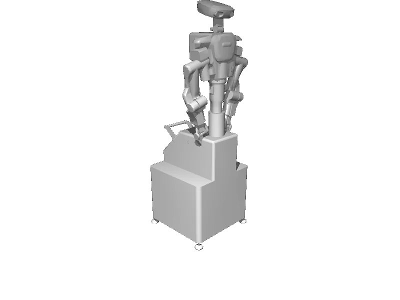

<!-- generated: docs/hooks/robot_pages.py -->

# nextage (dual_arm URDF from robot_descriptions)

<p class="sr-chips"><span class="sr-chip sr-chip-family" data-family="bimanual">Bimanual</span><span class="sr-chip">15 joints</span><span class="sr-chip sr-chip-sim">sim only</span></p>

URDF from [tork-a/rtmros_nextage@ac270fb](https://github.com/tork-a/rtmros_nextage/tree/ac270fb969fa54abeb6863f9b388a9e20c1f14e0), [compiled for MuJoCo](../learn/simulation/urdf.md) on first use: 15 position actuators, fixed base.



```python
from strands_robots import Robot

robot = Robot("nextage")
```
