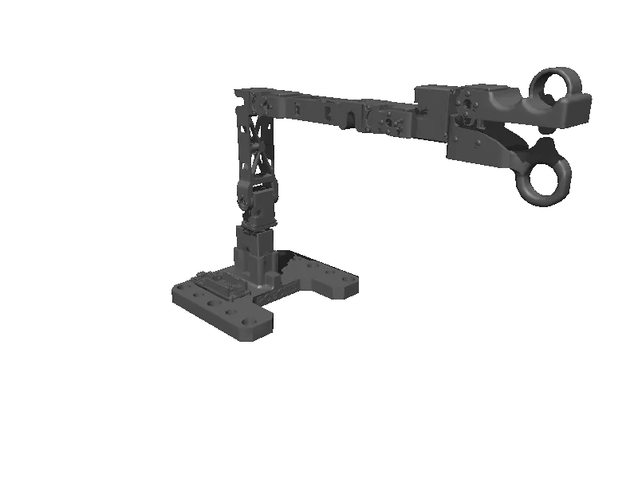

<!-- generated: docs/hooks/robot_pages.py -->

# omx_l (arm URDF from robot_descriptions)

<p class="sr-chips"><span class="sr-chip sr-chip-family" data-family="arm">Arms</span><span class="sr-chip">6 joints</span><span class="sr-chip sr-chip-sim">sim only</span></p>

URDF from [ROBOTIS-GIT/open_manipulator@bc555a9](https://github.com/ROBOTIS-GIT/open_manipulator/tree/bc555a9c41ebd7493dc945ddabc43fc649681b62), [compiled for MuJoCo](../learn/simulation/urdf.md) on first use: 6 position actuators, fixed base.



```python
from strands_robots import Robot

robot = Robot("omx_l")
```
