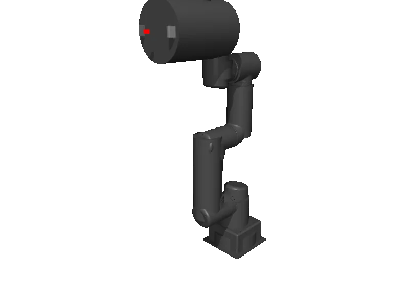

<!-- generated: docs/hooks/robot_pages.py -->

# omy_f3m (arm URDF from robot_descriptions)

<p class="sr-chips"><span class="sr-chip sr-chip-family" data-family="arm">Arms</span><span class="sr-chip">10 joints</span><span class="sr-chip sr-chip-sim">sim only</span></p>

A URDF from [ROBOTIS-GIT/open_manipulator](https://github.com/ROBOTIS-GIT/open_manipulator/tree/bc555a9c41ebd7493dc945ddabc43fc649681b62), compiled for MuJoCo by `strands_robots` on first use: 10 position actuators sized from the URDF effort limits, a fixed base, a floor and a light. See [URDF robots](../learn/simulation/urdf.md).



The MJCF is compiled on your machine, so this page has no 3D view; the thumbnail is a local render.

```python
from strands_robots import Robot

robot = Robot("omy_f3m")
```
