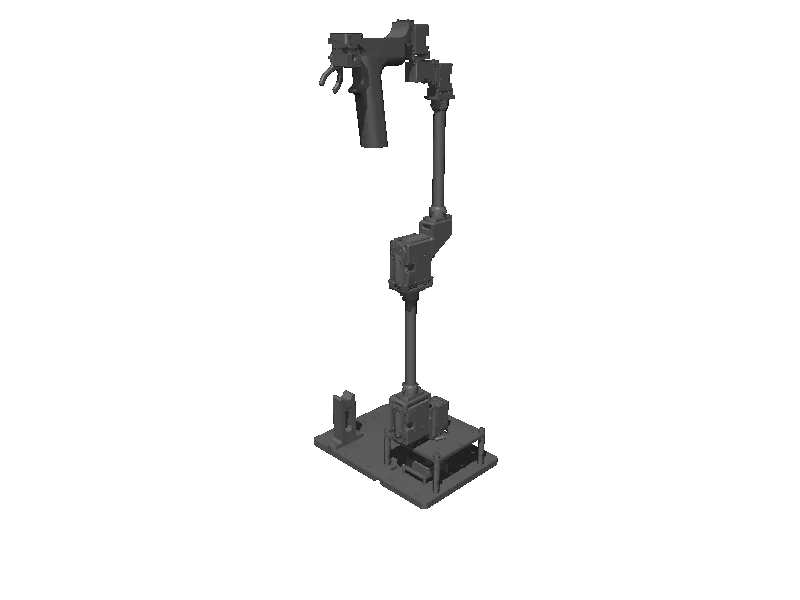

<!-- generated: docs/hooks/robot_pages.py -->

# omy_l100 (arm URDF from robot_descriptions)

{{robot_chips:omy_l100}}

URDF from [ROBOTIS-GIT/open_manipulator@bc555a9](https://github.com/ROBOTIS-GIT/open_manipulator/tree/bc555a9c41ebd7493dc945ddabc43fc649681b62), [compiled for MuJoCo](../learn/simulation/urdf.md) on first use: 7 position actuators, fixed base.



```python title="sketch"
from strands_robots import Robot

robot = Robot("omy_l100")  # clones the description and compiles the URDF on first use
print(robot.robot_joint_names("omy_l100"))
robot.cleanup()
```

Add a cube and a camera ([worlds and objects](../learn/simulation/worlds-and-objects.md)), then run a checkpoint on it ([same checkpoint](../start/first-policy.md)).

## Policies verified on this robot

No checkpoint verified on this robot yet. Record one: [Record](../learn/data/record.md), then [train](../learn/training/lerobot.md) and run it with `run_policy`.
