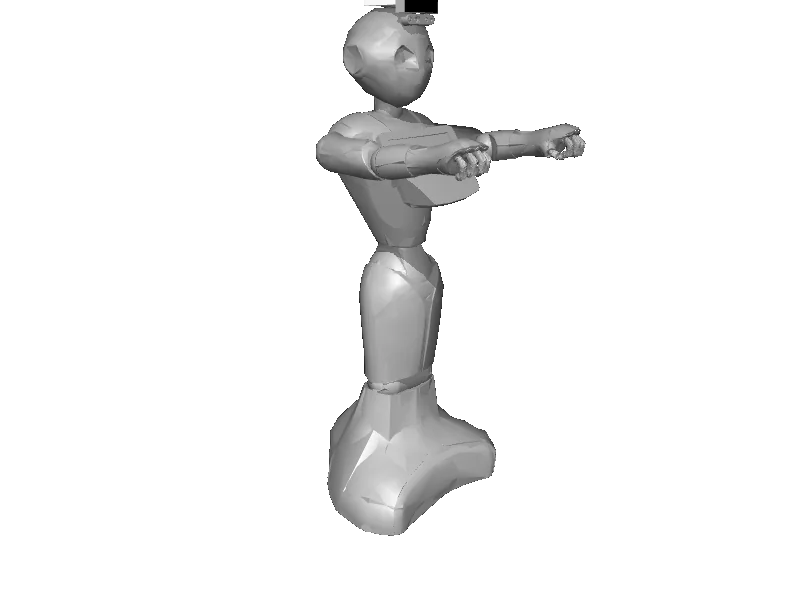

<!-- generated: docs/hooks/robot_pages.py -->

# pepper (mobile_manipulator URDF from robot_descriptions)

<p class="sr-chips"><span class="sr-chip sr-chip-family" data-family="mobile_manip">Mobile manipulators</span><span class="sr-chip">45 joints</span><span class="sr-chip sr-chip-sim">sim only</span></p>

A URDF from [jrl-umi3218/pepper_description](https://github.com/jrl-umi3218/pepper_description/tree/cd9715bb5df7ad57445d953db7b1924255305944), compiled for MuJoCo by `strands_robots` on first use: 45 position actuators sized from the URDF effort limits, a free-floating base, a floor and a light. See [URDF robots](../learn/simulation/urdf.md).



The MJCF is compiled on your machine, so this page has no 3D view; the thumbnail is a local render.

```python
from strands_robots import Robot

robot = Robot("pepper")
```
