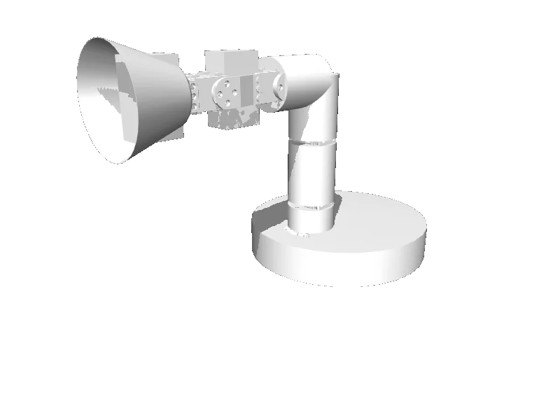

<!-- generated: docs/hooks/robot_pages.py -->

# poppy_ergo_jr (arm URDF from robot_descriptions)

{{robot_chips:poppy_ergo_jr}}

URDF from [poppy-project/poppy_ergo_jr_description@7eb32bd](https://github.com/poppy-project/poppy_ergo_jr_description/tree/7eb32bd385afa11dea5e6a6b6a4a86a0243aaa2b), [compiled for MuJoCo](../learn/simulation/urdf.md) on first use: 6 position actuators, fixed base.



```python title="sketch"
from strands_robots import Robot

robot = Robot("poppy_ergo_jr")  # clones the description and compiles the URDF on first use
print(robot.robot_joint_names("poppy_ergo_jr"))
robot.cleanup()
```

Add a cube and camera ([worlds and objects](../learn/simulation/worlds-and-objects.md)), then run a checkpoint on it ([same checkpoint](../start/first-policy.md)).

## Policies verified on this robot

No checkpoint verified on this robot yet. Record one: [Record](../learn/data/record.md), then [train](../learn/training/lerobot.md) and run it with `run_policy`.
