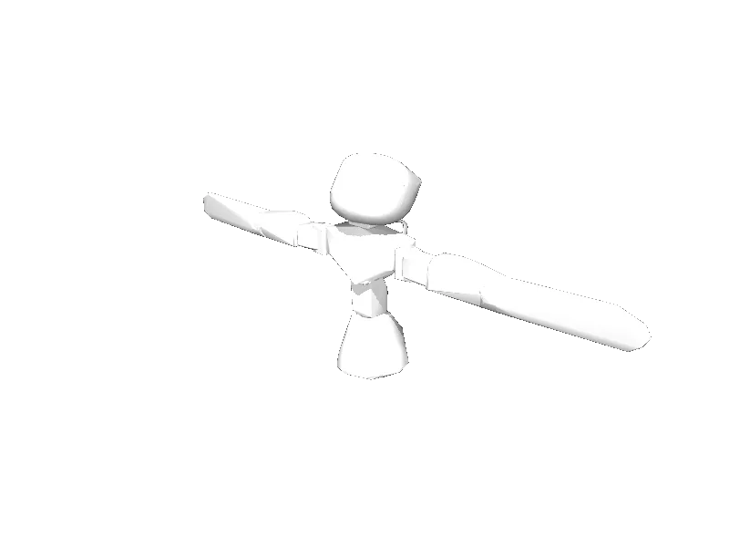

<!-- generated: docs/hooks/robot_pages.py -->

# poppy_torso (dual_arm URDF from robot_descriptions)

{{robot_chips:poppy_torso}}

URDF from [poppy-project/poppy_torso_description@6beeec3](https://github.com/poppy-project/poppy_torso_description/tree/6beeec3d76fb72b7548cce7c73aad722f8884522), [compiled for MuJoCo](../learn/simulation/urdf.md) on first use: 13 position actuators, fixed base.



```python
from strands_robots import Robot

robot = Robot("poppy_torso")
```

## Policies verified on this robot

No checkpoint verified on this robot yet. Record one: [Record](../learn/data/record.md), then [train](../learn/training/lerobot.md) and run it with `run_policy`.
