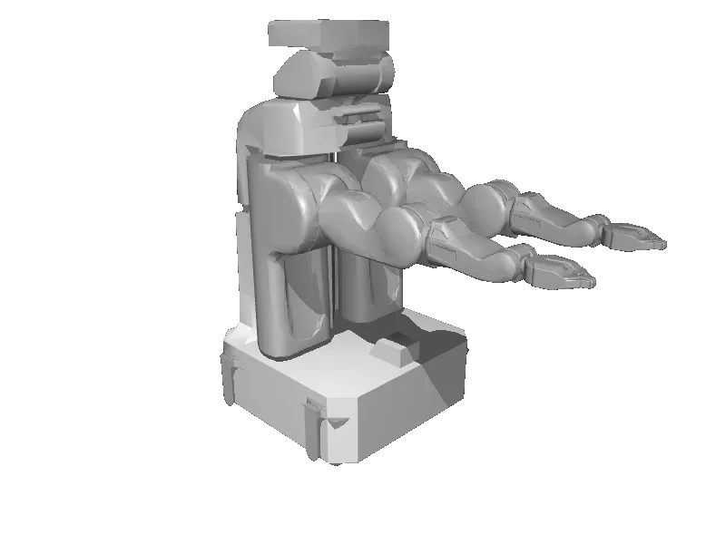

<!-- generated: docs/hooks/robot_pages.py -->

# pr2 (dual_arm mobile_manipulator URDF from robot_descriptions)

<p class="sr-chips"><span class="sr-chip sr-chip-family" data-family="mobile_manip">Mobile manipulators</span><span class="sr-chip">38 joints</span><span class="sr-chip sr-chip-sim">sim only</span></p>

URDF from [ankurhanda/robot-assets@12f1a3c](https://github.com/ankurhanda/robot-assets/tree/12f1a3c89c9975194551afaed0dfae1e09fdb27c), [compiled for MuJoCo](../learn/simulation/urdf.md) on first use: 38 position actuators, floating base.



```python
from strands_robots import Robot

robot = Robot("pr2")
```
