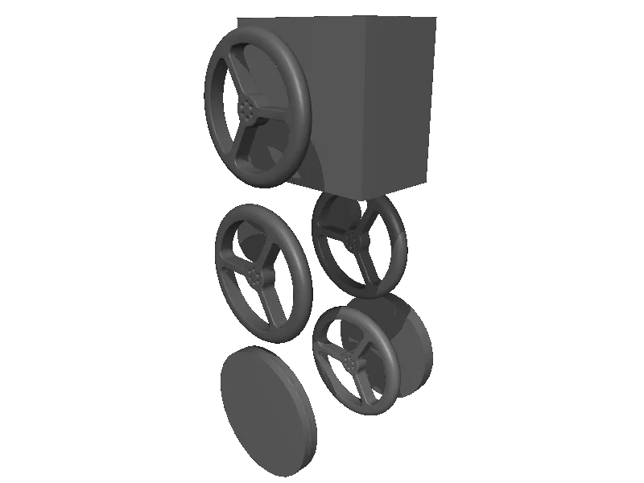

<!-- generated: docs/hooks/robot_pages.py -->

# rhea (biped URDF from robot_descriptions)

{{robot_chips:rhea}}

URDF from [G-Levine/rhea_description@1dc0f1a](https://github.com/G-Levine/rhea_description/tree/1dc0f1abcf51b5d8a8f7ff8a548399ff0df1414f), [compiled for MuJoCo](../learn/simulation/urdf.md) on first use: 6 position actuators, floating base.



```python title="sketch"
from strands_robots import Robot

robot = Robot("rhea")  # clones the description and compiles the URDF on first use
print(robot.robot_joint_names("rhea"))
robot.cleanup()
```

Walk it with a whole-body controller ([wbc](../learn/policies/wbc.md)) or a trained gait ([rl](../learn/policies/rl.md)).

## Policies verified on this robot

No checkpoint verified on this robot yet. Record one: [Record](../learn/data/record.md), then [train](../learn/training/lerobot.md) and run it with `run_policy`.
