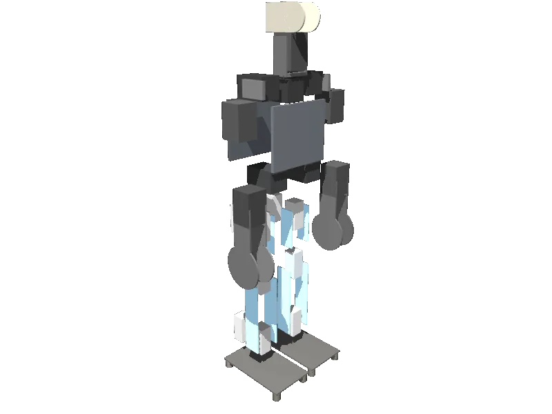

<!-- generated: docs/hooks/robot_pages.py -->

# sigmaban (humanoid URDF from robot_descriptions)

<p class="sr-chips"><span class="sr-chip sr-chip-family" data-family="humanoid">Humanoids</span><span class="sr-chip">20 joints</span><span class="sr-chip sr-chip-sim">sim only</span></p>

URDF from [Rhoban/sigmaban_urdf@d5d023f](https://github.com/Rhoban/sigmaban_urdf/tree/d5d023fd35800d00d7647000bce8602617a4960d), [compiled for MuJoCo](../learn/simulation/urdf.md) on first use: 20 position actuators, floating base.



```python
from strands_robots import Robot

robot = Robot("sigmaban")
```

## Policies verified on this robot

No checkpoint verified on this robot yet. Record one: [Record](../learn/data/record.md), then [train](../learn/training/lerobot.md) and run it with `run_policy`.
