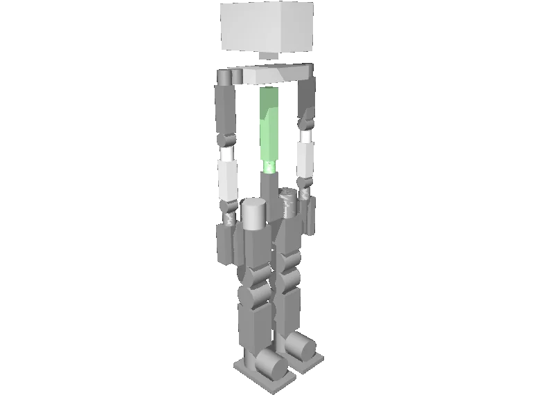

<!-- generated: docs/hooks/robot_pages.py -->

# simple_humanoid (educational humanoid URDF from robot_descriptions)

<p class="sr-chips"><span class="sr-chip sr-chip-family" data-family="humanoid">Humanoids</span><span class="sr-chip">29 joints</span><span class="sr-chip sr-chip-sim">sim only</span></p>

A URDF from [laas/simple_humanoid_description](https://github.com/laas/simple_humanoid_description/tree/4e859aed7df3c29954c9cca2a1ecb94069f7cfce), compiled for MuJoCo by `strands_robots` on first use: 29 position actuators sized from the URDF effort limits, a free-floating base, a floor and a light. See [URDF robots](../learn/simulation/urdf.md).



The MJCF is compiled on your machine, so this page has no 3D view; the thumbnail is a local render.

```python
from strands_robots import Robot

robot = Robot("simple_humanoid")
```
