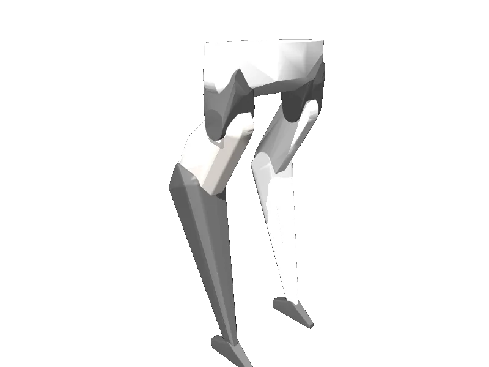

<!-- generated: docs/hooks/robot_pages.py -->

# spryped (biped URDF from robot_descriptions)

{{robot_chips:spryped}}

URDF from [bbokser/spryped@f360a6b](https://github.com/bbokser/spryped/tree/f360a6b78667a4d97c86cad465ef8f4c9512462b), [compiled for MuJoCo](../learn/simulation/urdf.md) on first use: 8 position actuators, floating base.



```python
from strands_robots import Robot

robot = Robot("spryped")
```

## Policies verified on this robot

No checkpoint verified on this robot yet. Record one: [Record](../learn/data/record.md), then [train](../learn/training/lerobot.md) and run it with `run_policy`.
