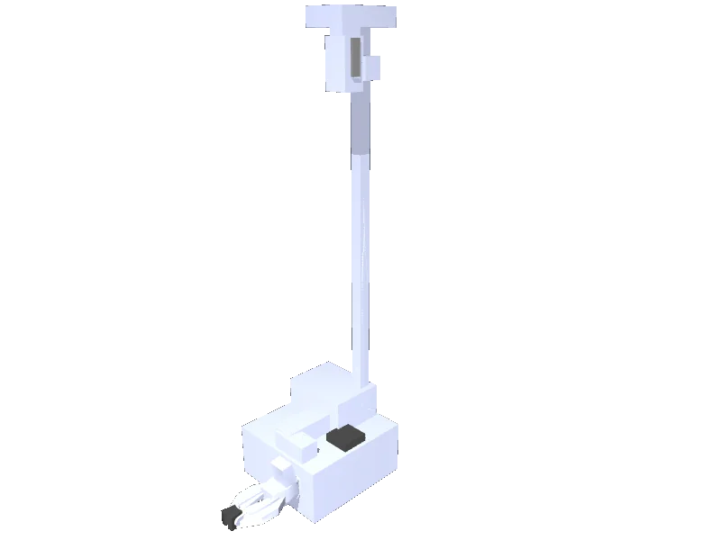

<!-- generated: docs/hooks/robot_pages.py -->

# stretch_se3 (mobile_manipulator URDF from robot_descriptions)

{{robot_chips:stretch_se3}}

URDF from [hello-robot/stretch_urdf@1b7cbbc](https://github.com/hello-robot/stretch_urdf/tree/1b7cbbce808c25465017ce0a53a4173fcf97b11c), [compiled for MuJoCo](../learn/simulation/urdf.md) on first use: 14 position actuators, floating base.



```python title="sketch"
from strands_robots import Robot

robot = Robot("stretch_se3")  # clones the description and compiles the URDF on first use
print(robot.robot_action_keys("stretch_se3"))
robot.cleanup()
```

The base and the arm share one action dict; [worlds and objects](../learn/simulation/worlds-and-objects.md) gives it a room.

## Policies verified on this robot

No checkpoint verified on this robot yet. Record one: [Record](../learn/data/record.md), then [train](../learn/training/lerobot.md) and run it with `run_policy`.
