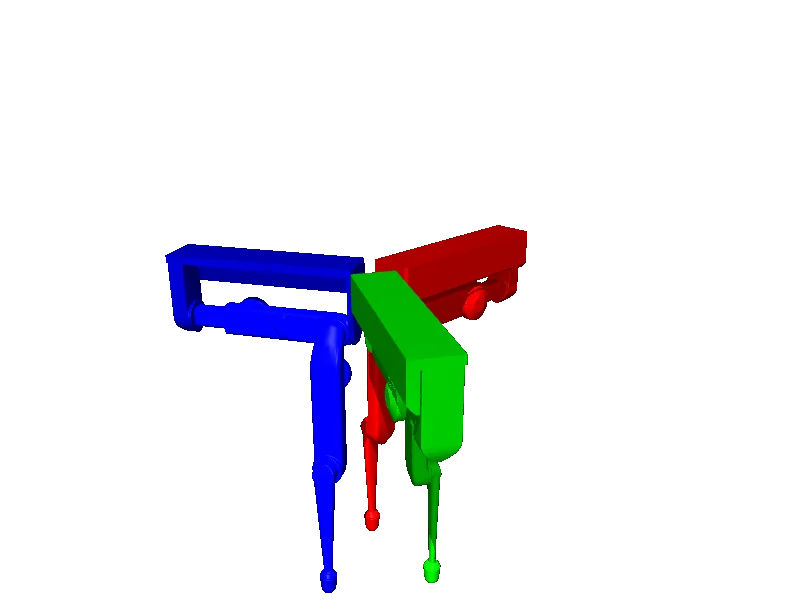

<!-- generated: docs/hooks/robot_pages.py -->

# trifinger_edu (educational URDF from robot_descriptions)

<p class="sr-chips"><span class="sr-chip sr-chip-family" data-family="arm">Arms</span><span class="sr-chip">9 joints</span><span class="sr-chip sr-chip-sim">sim only</span></p>

URDF from [facebookresearch/differentiable-robot-model@d7bd1b3](https://github.com/facebookresearch/differentiable-robot-model/tree/d7bd1b3b8ef1d6dabe9b68474a622185c510e112), [compiled for MuJoCo](../learn/simulation/urdf.md) on first use: 9 position actuators, fixed base.



```python
from strands_robots import Robot

robot = Robot("trifinger_edu")
```
