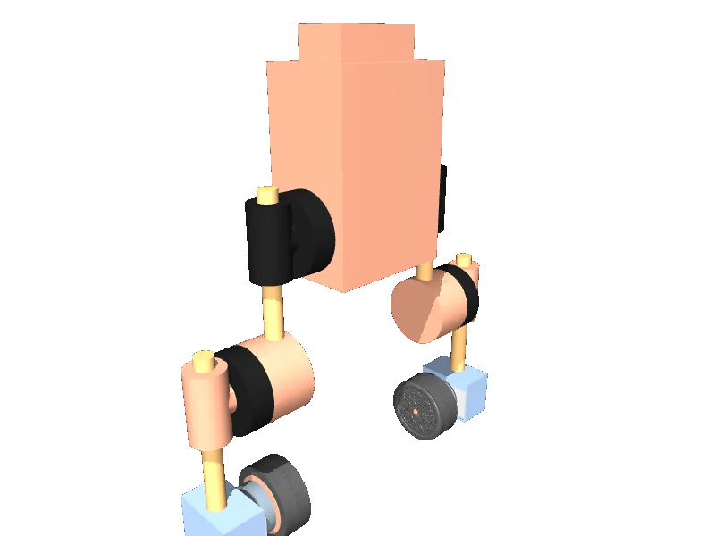

<!-- generated: docs/hooks/robot_pages.py -->

# upkie (biped wheeled URDF from robot_descriptions)

<p class="sr-chips"><span class="sr-chip sr-chip-family" data-family="humanoid">Humanoids</span><span class="sr-chip">6 joints</span><span class="sr-chip sr-chip-sim">sim only</span></p>

URDF from [upkie/upkie_description@19a91ce](https://github.com/upkie/upkie_description/tree/19a91ce69cab6742c613cab104986e3f8a18d6a5), [compiled for MuJoCo](../learn/simulation/urdf.md) on first use: 6 position actuators, floating base.



```python
from strands_robots import Robot

robot = Robot("upkie")
```
