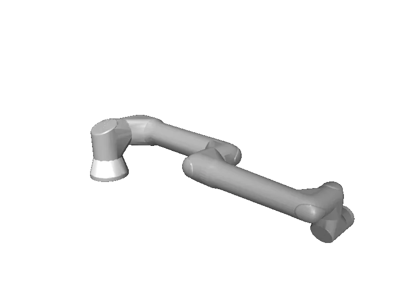

<!-- generated: docs/hooks/robot_pages.py -->

# ur15 (arm URDF from robot_descriptions)

<p class="sr-chips"><span class="sr-chip sr-chip-family" data-family="arm">Arms</span><span class="sr-chip">6 joints</span><span class="sr-chip sr-chip-sim">sim only</span></p>

A URDF from [UniversalRobots/Universal_Robots_ROS2_Description](https://github.com/UniversalRobots/Universal_Robots_ROS2_Description/tree/22f055da2fa7e2158254426107d1f257fd56aebb), compiled for MuJoCo by `strands_robots` on first use: 6 position actuators sized from the URDF effort limits, a fixed base, a floor and a light. See [URDF robots](../learn/simulation/urdf.md).



The MJCF is compiled on your machine, so this page has no 3D view; the thumbnail is a local render.

```python
from strands_robots import Robot

robot = Robot("ur15")
```
