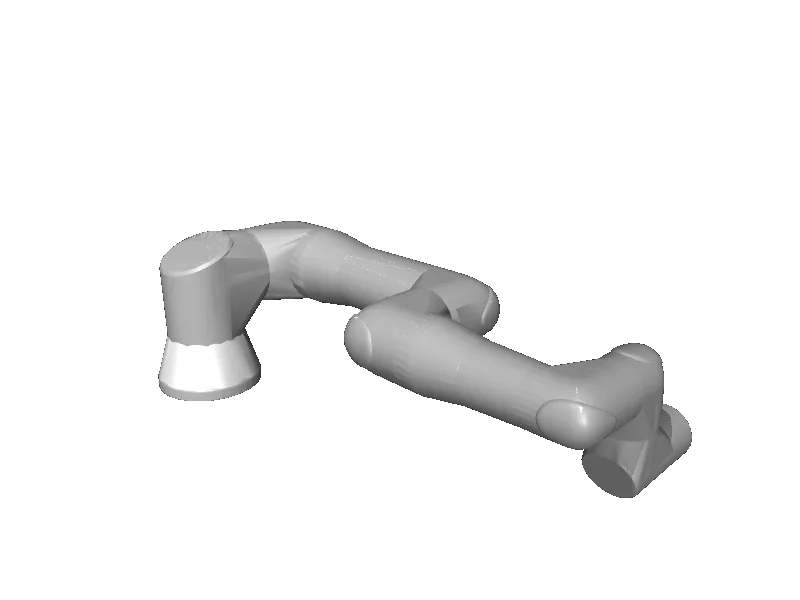

<!-- generated: docs/hooks/robot_pages.py -->

# ur18 (arm URDF from robot_descriptions)

{{robot_chips:ur18}}

URDF from [UniversalRobots/Universal_Robots_ROS2_Description@22f055d](https://github.com/UniversalRobots/Universal_Robots_ROS2_Description/tree/22f055da2fa7e2158254426107d1f257fd56aebb), [compiled for MuJoCo](../learn/simulation/urdf.md) on first use: 6 position actuators, fixed base.



```python
from strands_robots import Robot

robot = Robot("ur18")
```

## Policies verified on this robot

No checkpoint verified on this robot yet. Record one: [Record](../learn/data/record.md), then [train](../learn/training/lerobot.md) and run it with `run_policy`.
