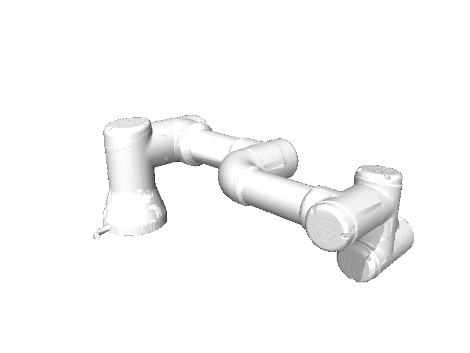

<!-- generated: docs/hooks/robot_pages.py -->

# ur3 (arm URDF from robot_descriptions)

<p class="sr-chips"><span class="sr-chip sr-chip-family" data-family="arm">Arms</span><span class="sr-chip">6 joints</span><span class="sr-chip sr-chip-sim">sim only</span></p>

URDF from [Gepetto/example-robot-data@d0d9098](https://github.com/Gepetto/example-robot-data/tree/d0d9098d752014aec3725b07766962acf06c5418), [compiled for MuJoCo](../learn/simulation/urdf.md) on first use: 6 position actuators, fixed base.



```python
from strands_robots import Robot

robot = Robot("ur3")
```
