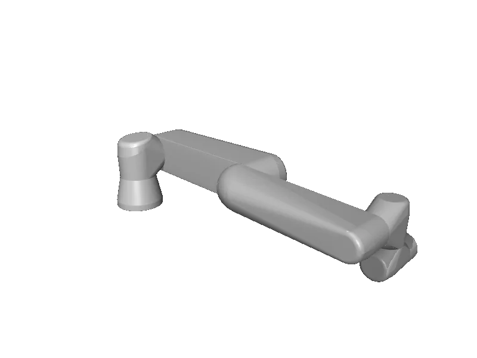

<!-- generated: docs/hooks/robot_pages.py -->

# ur7e (arm URDF from robot_descriptions)

<p class="sr-chips"><span class="sr-chip sr-chip-family" data-family="arm">Arms</span><span class="sr-chip">6 joints</span><span class="sr-chip sr-chip-sim">sim only</span></p>

URDF from [UniversalRobots/Universal_Robots_ROS2_Description@22f055d](https://github.com/UniversalRobots/Universal_Robots_ROS2_Description/tree/22f055da2fa7e2158254426107d1f257fd56aebb), [compiled for MuJoCo](../learn/simulation/urdf.md) on first use: 6 position actuators, fixed base.



```python
from strands_robots import Robot

robot = Robot("ur7e")
```
