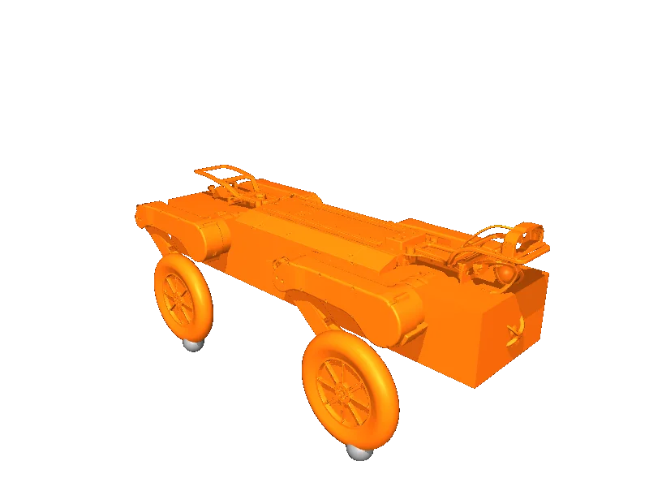

<!-- generated: docs/hooks/robot_pages.py -->

# wl_p311e (quadruped URDF from robot_descriptions)

<p class="sr-chips"><span class="sr-chip sr-chip-family" data-family="mobile">Mobile bases</span><span class="sr-chip">16 joints</span><span class="sr-chip sr-chip-sim">sim only</span></p>

URDF from [limxdynamics/robot-description@a097533](https://github.com/limxdynamics/robot-description/tree/a097533372a08298d45af391cbdfc2fd2dc3da6f), [compiled for MuJoCo](../learn/simulation/urdf.md) on first use: 16 position actuators, floating base.



```python
from strands_robots import Robot

robot = Robot("wl_p311e")
```

## Policies verified on this robot

No checkpoint verified on this robot yet. Record one: [Record](../learn/data/record.md), then [train](../learn/training/lerobot.md) and run it with `run_policy`.
