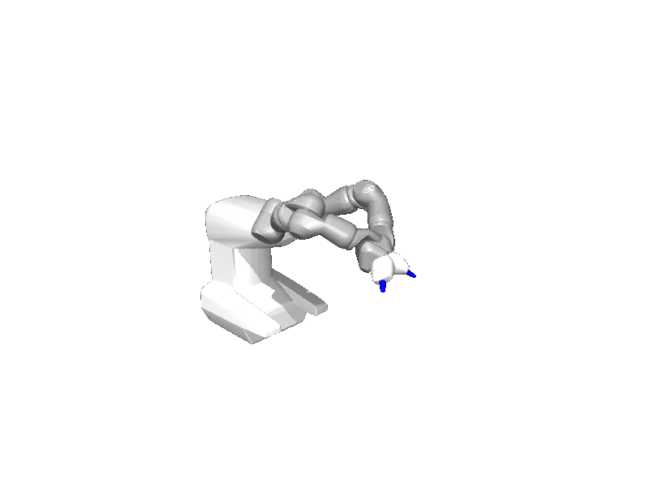

<!-- generated: docs/hooks/robot_pages.py -->

# yumi (dual_arm URDF from robot_descriptions)

<p class="sr-chips"><span class="sr-chip sr-chip-family" data-family="bimanual">Bimanual</span><span class="sr-chip">18 joints</span><span class="sr-chip sr-chip-sim">sim only</span></p>

A URDF from [ankurhanda/robot-assets](https://github.com/ankurhanda/robot-assets/tree/12f1a3c89c9975194551afaed0dfae1e09fdb27c), compiled for MuJoCo by `strands_robots` on first use: 18 position actuators sized from the URDF effort limits, a fixed base, a floor and a light. See [URDF robots](../learn/simulation/urdf.md).



The MJCF is compiled on your machine, so this page has no 3D view; the thumbnail is a local render.

```python
from strands_robots import Robot

robot = Robot("yumi")
```
