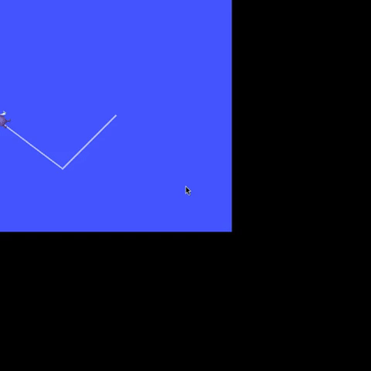
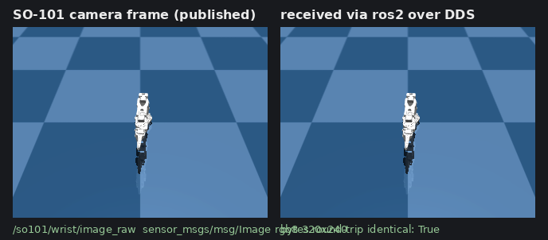

# ROS 2 integration

`use_ros` gives a Strands agent one entry point into any ROS 2 graph reachable
from the interpreter - list and echo topics, publish messages, call services
and send action goals - **in-process through `rclpy`**: no `ros2` CLI, no
generated code, one long-lived node reused across calls.

```python
from strands import Agent
from strands_robots.tools import use_ros

agent = Agent(tools=[use_ros])
agent("list the ROS 2 topics, then drive /turtle1 forward and confirm its pose changed")
```



*A Strands agent (Claude Opus via Amazon Bedrock) given the `use_ros` tool drives
a real ROS 2 `turtlesim` in a closed-loop square - reading pose, correcting
heading, and re-driving - over 43 in-process `use_ros` calls. See
[`examples/ros2/use_ros/`](https://github.com/strands-labs/robots/tree/main/examples/ros2/use_ros).*

## ROS 2 surfaces at a glance

| Surface | Role | Backend | Needs sourced ROS 2 | Use it to |
|---------|------|---------|---------------------|-----------|
| **`use_ros`** tool | client / observer + commander | in-process `rclpy` | yes | List/echo/publish topics, call services on any ROS 2 graph - full type coverage |
| **`use_rtps`** tool | participant / **act as a robot** | pure `cyclonedds` (pip) | **no** | Join a graph as a DDS peer and publish topics a real stack consumes; works on macOS/CI/Jetson, all distros |
| **`use_rosbridge`** tool + **`RosbridgeRobot`** | ROS1 / remote robots over a rosbridge WebSocket | pure-pip `roslibpy` | **no** | Drive ROS1 robots (e.g. the NASA Curiosity Gazebo sim) or any remote rosbridge robot from a machine with no ROS install - see [rosbridge integration](rosbridge-integration.md) |
| **`RosBridgedRobot`** | a ROS 2 robot as a strands `Robot` | `use_ros` | yes | `drive()`/`get_pose()` a `cmd_vel`/odom base with the same `Agent(tools=[robot])` UX as sim/hardware |
| **`AckermannRosRobot`** | an Ackermann ROS 2 car as a strands `Robot` | `use_ros` | yes | `drive()`/`get_scan()` a steering-geometry car (AWS DeepRacer servo stack) with bicycle-model conversion and an automatic enable handshake |
| **`SimEngine(ros2_bridge=True)`** | the **simulation as a ROS node** | `rclpy` | yes | Publish a running MuJoCo sim's `joint_states` + camera `image_raw` so rviz/nav2/agents can subscribe |
| **`Robot(ros2_bridge=True)`** | a **real robot as a ROS node** (full duplex) | `rclpy` | yes | Publish a physical arm's live `joint_states` + camera `image_raw` so rviz/nav2/agents subscribe to the hardware, **and** subscribe to `joint_command` to drive the arm - symmetric to the sim bridge, plus an inbound command path the sim does not need |

The `use_rtps` pure-RTPS path (no rclpy, every ROS 2 distro) is on the
[Pure-RTPS ROS 2](rtps-integration.md) page.

## Requirements

`rclpy` and `rosidl_runtime_py` must be importable in the interpreter that
runs the agent. They ship with a sourced ROS 2 distro and are not on PyPI:

```bash
source /opt/ros/jazzy/setup.bash   # or your distro / RoboStack / conda env
```

Without `rclpy` every action returns the same actionable error naming that
step (it never raises), so call shapes cannot be validated on a machine
without a distro - a Mac included. `use_ros(action="status")` reports
`rclpy (in-process)` or `none`. The `[ros2]` extra installs only the
pip-installable `cyclonedds` RMW binding, not ROS 2 itself.

## Actions

| Action | Required args | Returns |
|--------|---------------|---------|
| `status` | - | Whether the in-process rclpy backend is available |
| `list_topics` | - | Topics with their message types |
| `list_nodes` | - | Node names |
| `list_services` | - | Services with their types |
| `info` | `topic` or `service` | Topic (type + pub/sub counts) or service (type) details |
| `echo` | `topic` (type auto-resolved) | N samples as JSON |
| `publish` | `topic`, `type` | Publishes N messages built from `fields` |
| `service_call` | `service`, `type` | Service response as JSON |
| `list_actions` | - | Action servers with their types |
| `action_send_goal` | `action_name`, `type` | Terminal `{goal_status, result, feedback}` as JSON; goal is cancelled if `timeout` expires |

Types are resolved dynamically through `rosidl_runtime_py`, so any interface
installed in the environment works with no static registry; `fields` is a
plain dict applied with `set_message_fields`, so booleans and `null` survive.

## Examples

```python
use_ros(action="status")
use_ros(action="list_topics")

# Subscribe and read two samples (type auto-resolved from the graph)
use_ros(action="echo", topic="/turtle1/pose", count=2, timeout=2.0)

# Publish a velocity command. /cmd_vel is a gated surface - see
# "Safety-critical command surfaces need operator approval" below.
use_ros(action="publish", topic="/turtle1/cmd_vel",
        type="geometry_msgs/msg/Twist",
        fields={"linear": {"x": 2.0}, "angular": {"z": 1.5}})

# Call a service with a JSON request
use_ros(action="service_call", service="/spawn",
        type="turtlesim/srv/Spawn",
        fields={"x": 3.0, "y": 3.0, "name": "t2"})
```

## Try it live

```bash
cd examples/ros2/use_ros
docker compose run --build --rm showcase   # every action; exits 0 iff the turtle moved
docker compose run --build --rm agent      # a Strands Agent drives a closed-loop square
```

The showcase drives a real `turtlesim` through every `use_ros` action and the
agent draws the square above from a plain-English prompt; captured runs are in
`examples/ros2/use_ros/sample_output.txt` and `agent_sample_output.txt`.

## Safety

Topic, service and type names are validated against an allowlist
(alphanumerics plus `_ / ~ {}`; `pkg/msg/Name` or `pkg/srv/Name`) before they
reach rclpy; there is no shell or `eval` surface. Failures come back as
structured `{"status": "error"}` results. Numeric options are checked ahead of
the backend probe, so a caller mistake reports identically with or without a
sourced distro:

| Option | Consumed by | Accepted values |
|--------|-------------|-----------------|
| `count` | `echo`, `publish` | a positive integer - it is a `range()` bound, so `0` sends nothing and `2.7` or `"3"` cannot be honored |
| `rate` | `publish` | a positive finite number of Hz - the inter-message period is `1 / rate`, so `0`, a negative value, `nan` and `inf` all leave the burst unthrottled instead of paced |
| `timeout` | `echo`, `service_call`, `action_send_goal` | a positive finite number of seconds - `0` and negatives wait for nothing, `inf` never expires |

`timeout` is measured on a monotonic clock; one `action_send_goal` deadline
covers discovery, acceptance and result.

### Safety-critical command surfaces need operator approval

A robot is driven through three verbs - `publish`, `service_call` and
`action_send_goal` - and over three transports (`use_ros`, `use_rtps`,
`use_rosbridge`), so the gate is keyed on the surface **name**, owned once
(`strands_robots.tools._command_gate`) and consulted from all of them. These
surfaces are blocked by default:

| Surface | Usually reached by |
|---------|--------------------|
| `/cmd_vel`, `/cmd_vel_unstamped`, `/manual_drive` | `publish` |
| `/joint_command`, `/joint_trajectory`, `/joint_trajectory_controller/joint_trajectory` | `publish` |
| `/emergency_stop`, `/e_stop` | `service_call`, sometimes `publish` |
| `/motor_enable`, `/enable_motor`, `/disable_motor` | `service_call` |
| `/vehicle_state`, `/enable_state` | `service_call` |
| `/navigate_to_pose`, `/follow_path` | `action_send_goal` |

Matching is on the final path segment (`/my_robot/cmd_vel` is caught,
`/cmd_vel_evil` is not) in the form rclpy resolves it to; case is not folded,
because `/CMD_VEL` is a genuinely different topic. Three ways through the gate,
consulted in this order:

| Mode | Mechanism |
|------|-----------|
| Interactive (default) | `tool_context.interrupt()` prompts the operator; reply `y` to approve |
| Headless allowlist | `STRANDS_ROS2_COMMAND_ALLOW=/cmd_vel,/follow_path` pre-approves those surfaces and every namespaced surface sharing a base name with one of them; a surface whose base name no entry lists stays gated |
| Fully trusted | `BYPASS_TOOL_CONSENT=true` allows every blocked surface with a WARNING log |

Both lists match by base name as well as exact name, so
`STRANDS_ROS2_COMMAND_ALLOW=/cmd_vel` lifts the gate on **every** robot's
drive topic; name the namespace (`/turtle1/cmd_vel`) to cover one robot. The
gate **fails closed**: with no `tool_context` or no `interrupt()` the command is
refused and the error names both environment variables. Only `y` / `yes` /
`approve` / `approved` count as approval; the reply is written to the local
safety audit log on both outcomes and never echoed into the agent's context
(see [Security](security.md)). Anything that wraps `use_ros` must forward the
context: `RosBridgedRobot`'s command tools are `@tool(context=True)` and do,
while a programmatic `robot.drive(...)` has no operator to prompt and needs the
surface pre-approved. Reads (`echo`, `info`, `list_*`) are never gated, and the
gate runs after argument validation, so an operator is never asked to approve a
call that could not have run.

## Ackermann robots (AWS DeepRacer)

Differential-drive bases take `geometry_msgs/msg/Twist`; the DeepRacer's stock
stack takes normalized servo pairs (`deepracer_interfaces_pkg/msg/ServoCtrlMsg`)
after a two-step manual-mode handshake (`/ctrl_pkg/vehicle_state`, then
`/ctrl_pkg/enable_state`). `AckermannRosRobot` absorbs both:


    from strands_robots.mesh import AckermannRosRobot

    car = AckermannRosRobot.from_deepracer(node_name="deepracer")
    car.drive(linear=0.5, angular=1.0, duration=2.0)

`drive()` keeps the `(linear, angular)` contract; a bicycle model converts to
servo values, the handshake runs once before the first command, timed drives
always end in a zero servo message (a failed halt is reported as an error
naming the live throttle), and holds beyond `max_duration` are refused. The
stock platform publishes no odometry, so there is no `get_pose`. The bridge
inherits the [command gate](#safety-critical-command-surfaces-need-operator-approval):

| Method / tool | Reaches | Gated |
|---------------|---------|-------|
| `drive()` / `drive_<node>` | `publish` to the servo topic (plus the handshake on the first call) | yes |
| `stop()` / `stop_<node>` | `publish` to the servo topic | yes - the gate is keyed on the surface, not the payload |
| `enable()` | `service_call` to both mode services | yes |
| `get_scan()` / `get_scan_<node>` | `echo` | never gated |

Pre-approve the three surfaces for a headless run (bare names cover the
namespaced DeepRacer spellings); see `examples/ros2/deepracer_agent.py`:

```bash
export STRANDS_ROS2_COMMAND_ALLOW=/manual_drive,/vehicle_state,/enable_state
```

## Sim bridge: publish a simulation on a ROS 2 domain

Construct any `SimEngine` with `ros2_bridge=True` and an internal `rclpy` node
publishes, per robot, after every `step()`:

| Topic | Type | Content |
|-------|------|---------|
| `/<robot>/joint_states` | `sensor_msgs/msg/JointState` | joint names + positions |
| `/<robot>/<camera>/image_raw` | `sensor_msgs/msg/Image` (`rgb8`) | one frame per attached camera. `<robot>`/`<camera>` are sanitised into ROS 2 name tokens, so a camera named `0` publishes on `/<robot>/camera_0/image_raw` - ROS 2 forbids a token starting with a digit |

```python
from strands_robots.simulation import Simulation

sim = Simulation(ros2_bridge=True, ros2_domain=0)
sim.create_world()
sim.add_robot("so101")
sim.step(10)   # publishes /so101/joint_states (+ camera image_raw) on domain 0
```

```bash
ros2 topic list | grep so101          # /so101/joint_states, /so101/<cam>/image_raw
ros2 topic echo /so101/joint_states   # live joint positions, updated every step
```

`ros2_transport='rtps'` is hardware-only; the simulation bridge publishes over
rclpy. When `rclpy` is missing, `ros2_bridge=True` raises an `ImportError` at
construction naming the `source /opt/ros/<distro>/setup.bash` step;
`ros2_bridge=False` (the default) never touches ROS 2. The node is torn down on
`destroy()`. See `examples/ros2/sim_bridge_demo.py`.

## Hardware bridge: publish a real robot on a ROS 2 domain

The hardware `Robot` is the symmetric counterpart: `ros2_bridge=True` gives it
a `HardwareRosBridge`, and because sim, hardware and pure-RTPS bridges share
one `RosTelemetryBase`, a physical arm and its digital twin publish
**identical topics**:

| Topic | Direction | Type | Content |
|-------|-----------|------|---------|
| `/<robot>/joint_states` | published | `sensor_msgs/msg/JointState` | joint names + positions, every control step |
| `/<robot>/<camera>/image_raw` | published | `sensor_msgs/msg/Image` (`rgb8`) | one frame per camera |
| `/<robot>/joint_command` | **subscribed** | `sensor_msgs/msg/JointState` | inbound `name`/`position` -> `send_action`, drives the real arm |

The third row makes the hardware bridge full duplex: an external node (teleop,
MoveIt, or the agent's own `use_ros(action="publish")`) publishes a
`JointState` with the same joint names the bridge publishes, and each message
is forwarded into `Robot.send_action`. The sim bridge does not subscribe.

```python
from strands_robots import Robot

# Opt in to the bridge; the arm's observation is mirrored on ROS 2 domain 0.
arm = Robot("so101", mode="real", ros2_bridge=True, ros2_domain=0)

# Each control step of a running task publishes joint_states (+ camera frames).
# Or publish the current observation on demand without starting a task:
arm.publish_ros_observation()                 # joints + cameras
arm.publish_ros_observation(skip_images=True)  # joints only (opt out of cameras)

# Full duplex: with the default ros2_commands=True the bridge also subscribes to
# /so101/joint_command and forwards each message into Robot.send_action, so an
# external ROS 2 node can drive the real arm:
#
#   ros2 topic pub --once /so101/joint_command sensor_msgs/msg/JointState \
#     '{name: ["shoulder_pan.pos", "elbow.pos"], position: [0.1, -0.2]}'
#
# For a read-only telemetry bridge (no inbound control), opt out:
arm_ro = Robot("so101", mode="real", ros2_bridge=True, ros2_commands=False)

# rclpy-free: run the SAME bridge over pure cyclonedds (no sourced ROS 2
# distro). Byte-identical topics; type coverage bounded by the IDL bundle.
arm_rtps = Robot("so101", mode="real", ros2_bridge=True, ros2_transport="rtps")
```

```bash
ros2 topic list | grep so101          # /so101/joint_states, /so101/<cam>/image_raw
ros2 topic echo /so101/joint_states   # live joint positions from the real arm
```

The bridge is opt-in (`ros2_bridge=False` by default). Without `rclpy` it
raises an `ImportError` naming both routes: source a distro, or
`ros2_transport="rtps"`, which publishes the same topics over the
pip-installable cyclonedds binding. `ros2_commands=False` makes it read-only;
both flags must be real booleans. Two guards harden the inbound command topic:
`joint_limits={"<motor>.pos": (min, max)}` rejects the **entire** command when
any joint is out of range (bounds must be finite), and on the RTPS transport a
`dds_security_config` (or the explicit
`STRANDS_ROS2_BRIDGE_I_KNOW_THIS_IS_INSECURE=1` opt-out) is required to expose
the command surface - see
[RTPS integration](rtps-integration.md#securing-the-inbound-command-surface).
See `examples/ros2/hardware_bridge_demo.py`.



The frame above was published on `/so101/wrist/image_raw` by
`HardwareRosBridge` over real DDS and decoded by a separate `rclpy` subscriber -
a byte-identical round trip.

## Mesh bridge: a ROS 2 robot as a first-class strands Robot

For mobile bases exposing the `cmd_vel` / odometry / scan trio,
`RosBridgedRobot` wraps `use_ros` so a remote ROS 2 robot drives like any
other strands robot:

```python
import os

from strands import Agent
from strands_robots.mesh import RosBridgedRobot

turtle = RosBridgedRobot.from_ros(
    node_name="turtlesim",
    cmd_vel_topic="/turtle1/cmd_vel",
    odom_topic="/turtle1/pose",
    odom_type="turtlesim/msg/Pose",  # optional; auto-resolved when omitted
)

# Direct, programmatic control. cmd_vel is a gated command surface and a script
# has no operator to prompt, so pre-approve the topics this process drives:
os.environ["STRANDS_ROS2_COMMAND_ALLOW"] = "/turtle1/cmd_vel"
turtle.drive(linear=1.0, duration=1.5)   # hold the command for 1.5 s
print(turtle.get_pose())                 # reads are never gated
turtle.stop()

# Or hand the robot to an agent - its capabilities become named tools
# (drive_turtlesim, stop_turtlesim, get_pose_turtlesim, ...):
agent = Agent(tools=turtle.tools)
agent("drive forward for two seconds, then tell me the pose")
```

Every method forwards to `use_ros`, so the bridge inherits its backend, its
validation and the
[command gate](#safety-critical-command-surfaces-need-operator-approval):

| Method | ROS 2 action | Notes |
|--------|--------------|-------|
| `drive(linear, angular, duration=, count=)` | publish `Twist` to `cmd_vel_topic` | `duration` holds the command at `publish_rate` Hz; finite velocities, `duration > 0`, `count >= 1` - anything else is refused without publishing. Gated: needs an operator context or a pre-approved surface |
| `stop()` | publish zero `Twist` | Gated like `drive` - same surface, same verb |
| `navigate_to(x, y, yaw=, frame_id=, timeout=)` | `action_send_goal` to `nav_action` | error when no `nav_action` configured; finite pose components. Gated |
| `get_pose()` | echo `odom_topic` | never gated |
| `get_scan()` | echo `scan_topic` | error when no `scan_topic` configured; never gated |
| `.tools` | - | per-instance named agent tools; the command tools are `@tool(context=True)` so the gate can prompt |

### The shared mobile-base contract

`RosBridgedRobot` and `AckermannRosRobot` are thin subclasses of
`MobileBaseRobot`, which owns the drive contract for every mobile robot in
`strands_robots.mesh`; a platform supplies only a `Transport` and, when it is
not differential-drive, a `_cmd_fields` override. The contract: non-finite
`linear` / `angular` / `duration` refused; `count` a positive whole number;
`duration` positive, finite and within `max_duration`; velocities clamped to
`max_linear` / `max_angular` when set; every timed or multi-message command
followed by a zero command through `try`/`finally`; a bare `drive()` latches
until `stop()`; `stop()` reaches the command gate exactly as `drive()` does,
independent of the enable handshake; command tools are `@tool(context=True)`;
`init_services` runs once before the first command and re-runs after a
failure. Capabilities are reported, not assumed: `get_pose` appears only with
an `odom_topic`, `get_scan` only with a `scan_topic`, `navigate` only with a
`nav_action`. See `examples/ros2/turtlebot_demo.py`.


