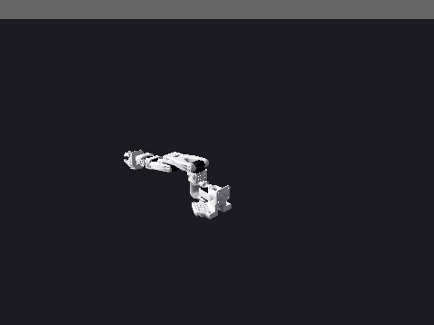

# Newton Scenes, Viewer and Recording

What a live [Newton backend](newton.md) scene answers and records: discovery and
per-joint state, the interactive viewer, LeRobotDataset recording, per-episode
randomization and mesh objects. The backend contract, solvers and install are on
the [Newton backend](newton.md) page.

## Scene discovery and state queries

The backend exposes the same discovery and per-joint state surface as the MuJoCo
backend:

- `get_robot_state(robot_name=None)` returns each joint's `position` and
  `velocity` (read from `joint_q` / `joint_qd`) in a `json` block, plus a
  human-readable summary. `get_observation` carries that velocity beside each
  position under `<joint>.vel` - the spelling the velocity-feedback locomotion
  policies (Microduck, WBC, ProtoMotions) read.
- `list_robots_info()` and `list_objects()` return pretty-printed listings of
  the robots and primitive objects in the world. Both report **live** poses,
  read from the solver's `body_q` rather than from the `add_robot` /
  `add_object` request: a `unitree_go2` asked for `z=0` is listed at the
  `z=0.445` its authored root offset puts it at, and anything that has since
  moved is listed where it is. A robot with several root bodies (an `aloha`
  attaches two arm bases) has no one base pose to measure, so its line reports
  the requested transform and says so. A static object reports its record:
  Newton bakes a static shape into the world instead of giving it a body.
- `list_bodies(robot_name=None)` lists Newton body labels and, when scoped to
  a robot, resolves a best-guess `gripper_body` mount (a body whose trailing
  path segment *names* `gripper`, `hand`, `jaw`, `ee`, or `tool` as one of its
  words). Hints match on word boundaries, so a `knee` link is not a gripper
  mount for the `ee` inside it, and a robot with no gripper-like body reports
  `None`.
- `move_object(name, position=None, orientation=None)` repositions an object and
  rebuilds the model, preserving live joint targets.
- `get_features(robot_name=None)` reports the model's joint / body / DOF counts,
  timestep, solver, and per-robot joint listings (matching the MuJoCo
  `features` schema).
- `list_urdfs()` / `register_urdf(data_config, urdf_path)` read from and write
  to the shared model registry, so assets registered for one backend resolve
  for the other.

`describe()` advertises these methods and the available cameras / bodies, so a
single call surfaces the full contract.

```python
sim.add_robot("so100")
sim.send_action({"Rotation": 0.6, "Elbow": -0.4}, robot_name="so100", n_substeps=10)

state = sim.get_robot_state("so100")["content"][1]["json"]["state"]
# {"Rotation": {"position": 0.03, "velocity": 3.72}, ...}

mount = sim.list_bodies("so100")["content"][1]["json"]["gripper_body"]
# "so_arm100/.../Fixed_Jaw"
```

## Live viewer

`open_viewer()` brings an interactive view up on the running model, mirroring
the MuJoCo backend's entry point. It wraps Newton's own viewers and feeds one
frame per control step, so the view tracks the simulation live while `step`,
`send_action` or `run_policy` drive it.



```python
sim = create_simulation("newton", solver="mujoco")
sim.create_world()
sim.add_robot("so100")

sim.open_viewer()                 # "auto": GL window if a display is present
# ... or pick a viewer explicitly:
sim.open_viewer("viser", port=8080)   # browser dashboard at http://localhost:8080
sim.open_viewer("gl")                 # native OpenGL window (needs a display)

sim.run_policy(robot_name="so100", policy_provider="mock", n_steps=200)
sim.close_viewer()
```

Viewer kinds (the `viewer` argument):

- `"auto"` (default) - opens the `"gl"` window when a display server is present
  (`DISPLAY` / `WAYLAND_DISPLAY` set), otherwise `"viser"`, so headless hosts
  still get a live view.
- `"gl"` - `newton.viewer.ViewerGL` native OpenGL window, sized by `width` /
  `height` (default `1280x720`). Requires a display; on a headless host
  `open_viewer("gl")` returns a structured error pointing at `"viser"` or
  `render(...)` instead of crashing. The size is on the same floor `add_camera`
  and `render(...)` apply - a positive `int` - and a refused size leaves the
  single viewer slot free for the retry.
- `"viser"` - `newton.viewer.ViewerViser` browser dashboard served at
  `http://localhost:<port>` (default `8080`). Works headless, which makes it the
  choice for live inspection on a remote GPU box; the success message reports the
  dashboard URL.
- `"null"` - `newton.viewer.ViewerNull` no-op sink (useful for tests and
  benchmarks).

The viewer renders Newton's own free 3D camera (orbit / pan / zoom),
independent of the single fixed `render()` view, so framing is adjusted
interactively rather than by name. The handle is released when the window is
closed, on `close_viewer()` and on `destroy()`; a dead viewer never interrupts
stepping, and adding or removing robots rebinds the viewer to the rebuilt
model. It is driven on the thread that steps the simulation, so open it and
then call the blocking `run_policy` / `step` on that thread; for a headless
artifact use `run_policy(video={...})` instead.

## Dataset recording

Recording writes the same LeRobotDataset format as the MuJoCo backend:

```python
sim = create_simulation("newton", solver="mujoco")
sim.create_world()
sim.add_robot("so100")

# the rollouts below adopt this fps (they pass no control_frequency)
sim.start_recording(repo_id="local/newton_demo", task="pick the cube", fps=50)
for _ in range(n_episodes):
    sim.run_policy(robot_name="so100", policy_provider="mock", n_steps=200)
    sim.save_episode()          # flush this rollout as one episode
    sim.reset()                 # next rollout starts from the scene pose
result = sim.stop_recording()   # finalize parquet + video
sim.verify_dataset_episodes(n_episodes)   # parquet-truth check
```

`save_episode` cuts the episode boundary; `reset()` re-initializes the world.
Drop the `reset()` and `verify_dataset_episodes` still passes, but every
episode after the first starts from the previous rollout's final pose instead
of the scene's. `run_policy(n_episodes=...)` performs both steps for you.

`start_recording` declares the dataset schema from the live scene - joint names
from every robot (namespaced `robot__joint` in multi-robot scenes) plus any
named cameras registered on the world, each at its real render resolution. The
`on_frame` hook the shared `run_policy` loop invokes feeds joint state, action
and rendered frames to the recorder every control step. Episode boundaries,
finalization and the parquet-correctness gate come from the backend-agnostic
recording lifecycle, so a Newton recording satisfies the same contract as
MuJoCo: `total_episodes == N`, episode parquet `num_rows == N`, and
`len(unique(episode_index)) == N`.

Recording requires the `lerobot` extra (`pip install "strands-robots[lerobot]"`).
With no named cameras the dataset records joint state and action only (a valid
proprio-only dataset); camera columns appear once cameras are registered.


## Domain randomization and sensor noise

The Newton backend mirrors the MuJoCo `randomize` contract (same keyword names
and defaults for the axes it supports) and adds `set_obs_noise` for additive
Gaussian sensor noise.

```python
sim = create_simulation("newton", solver="mujoco")
sim.create_world()
sim.add_robot("so100")

# Per-episode domain randomization. Physics is opt-in (matches MuJoCo's
# randomize_physics=False default); colors and lighting are on by default.
for episode in range(10):
    sim.reset()
    result = sim.randomize(
        randomize_colors=True,
        randomize_lighting=True,
        randomize_physics=True,
        mass_range=(0.8, 1.2),       # multiplicative scale on per-body mass
        friction_range=(0.5, 1.5),   # multiplicative scale on per-shape friction
        seed=episode,                # deterministic per episode
    )
    scales = result["content"][1]["json"]
    # scales["mass_scales"], scales["friction_scales"], scales["light_direction"]
    sim.run_policy(robot_name="so100", policy_provider="mock", n_steps=60)
```

What each axis changes, applied to the Newton `ModelBuilder` before the
immutable model is finalised and then rebuilt:

| Axis | What changes | Range param |
|------|--------------|-------------|
| `randomize_colors` | Per-shape RGB (`builder.shape_color`) | `color_range` |
| `randomize_lighting` | Directional-light orientation (re-steered each render) | - |
| `randomize_physics` | Per-body mass + inertia (`body_mass` / `body_inertia`) and per-shape friction (`shape_material_mu`) | `mass_range`, `friction_range` |

Physics randomization scales mass and inertia together (inertia tracks mass for
fixed geometry); Newton recomputes the inverse mass/inertia at finalisation. A
fixed `seed` yields an identical multiplier sequence for a given scene, because
the builder visits bodies and shapes in a deterministic order, and the applied
multipliers are returned in the `json` block. Object-position randomization
(`randomize_positions`) is not supported here; requesting it returns an explicit
error rather than silently doing nothing.

### Sensor noise

`set_obs_noise` adds additive Gaussian noise so observations carry measurement
error. It applies to every `get_observation` / `get_robot_state` and every
rendered camera frame until reconfigured (pass all-zero to disable):

```python
sim.set_obs_noise(
    joint_pos_std=0.01,     # radians, added to joint positions
    joint_vel_std=0.05,     # rad/s, added to the joint velocities
    camera_jitter_px=2,     # max integer pixel shift on rendered frames
    seed=0,                 # reproducible noise stream
)
obs = sim.get_observation("so100")   # joint positions now carry +/- noise
```

## Mesh objects

`add_object` accepts triangle-mesh assets in addition to primitives, as the
MuJoCo backend does - but not under the same `size` contract, so a
`shape="mesh"` call is not portable between the two (below):

```python
sim.add_object(name="tool", shape="mesh", mesh_path="/abs/path/widget.obj",
               position=[0.3, 0.0, 0.05], mass=0.2)
```

`mesh_path` accepts anything `trimesh.load` reads (`.obj`, `.stl`, `.glb`,
`.usd`, ...). The asset is parsed once (cached by path), converted to a
`newton.Mesh` and added as a collision/visual shape; `size` acts as a per-axis
scale (default `[1, 1, 1]`, the mesh's own units). `move_object`,
`remove_object` and `list_objects()` work on mesh objects. Mesh loading requires
the `sim-newton` extra (which ships `trimesh`).

`size` is where the two backends part. This backend consumes it as that scale;
the MuJoCo backend discards it for a mesh and takes the extent from the asset
alone. So `size=[2, 2, 2]` doubles the asset here and is dropped there, with
both calls reporting success - the one portable mesh add is one that omits
`size` and ships the asset already in metric units. Which meaning `size` should
carry for a mesh is an open contract decision, tracked in
[#2300](https://github.com/strands-labs/robots/issues/2300).

## See also

- [Newton backend](newton.md) - install, solvers, parity and URDF robots.
- [Domain Randomization](domain-randomization.md) - the backend-agnostic
  randomization contract this page mirrors.
