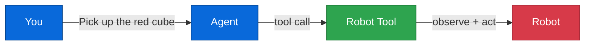

# Chapter 4: AI Agents

**Time:** 15 minutes · **Hardware:** None needed · **Level:** Intermediate

Until now, you've been writing Python to control robots. In this chapter, you'll use **natural language** instead. Tell the robot what to do in plain English.

---

## Why Agents?

Writing `robot.apply_action([0.1, -0.2, ...])` works, but:

- You need to know the exact joint values
- You can't easily chain complex tasks
- There's no reasoning about *what* to do

An **AI agent** bridges the gap between human intent and robot action. You say "pick up the red cube" and the agent figures out the rest.

---

## Your First Robot Agent

```python
from strands import Agent
from strands_robots import Robot

robot = Robot("so100")
agent = Agent(tools=[robot])

agent("Pick up the red cube")
```

That's it. The agent:

1. Receives your instruction
2. Calls the Robot tool with the right parameters
3. The robot executes using its configured policy
4. Reports back the result

---

## How It Works

The `Robot` class is a **Strands tool**. When you pass it to `Agent(tools=[robot])`, the agent can call it like any other tool.



The agent decides **when** and **how** to use the robot tool based on your instruction.

---

## Multiple Tools

Real robot workflows need more than just movement. Add cameras, poses, and inference:

```python
from strands import Agent
from strands_robots import Robot, gr00t_inference, lerobot_camera, pose_tool

agent = Agent(tools=[
    Robot("so100"),
    gr00t_inference,
    lerobot_camera,
    pose_tool,
])

# The agent can now:
agent("Discover what cameras are available")
agent("Save the current position as 'home'")
agent("Pick up the red block using GR00T, then go back to home")
```

The agent orchestrates all the tools together — discover cameras, start inference, control the robot, manage poses — all from natural language.

---

## Async Control

For long-running tasks, use non-blocking execution:

```python
# Start a task (returns immediately)
agent("Start the robot waving its arm")

# Check on it
agent("What's the robot's status?")

# Stop if needed
agent("Stop the robot")
```

The Robot tool supports `execute` (blocking), `start` (async), `status`, and `stop` actions.

---

## Conversation Memory

The agent remembers context within a session:

```python
agent("Move to the home position")
agent("Now move 10cm to the left")        # Knows "left" relative to current pose
agent("Pick up whatever is in front of you")  # Remembers the robot's state
```

---

## What You Learned

- ✅ `Agent(tools=[robot])` enables natural language control
- ✅ The agent orchestrates tool calls automatically
- ✅ Multiple tools compose together (camera, pose, inference)
- ✅ Async control for long-running tasks
- ✅ Conversation memory for contextual commands

---

**Next:** [Chapter 5: Multi-Robot →](05-multi-robot.md) — Coordinate multiple robots.
