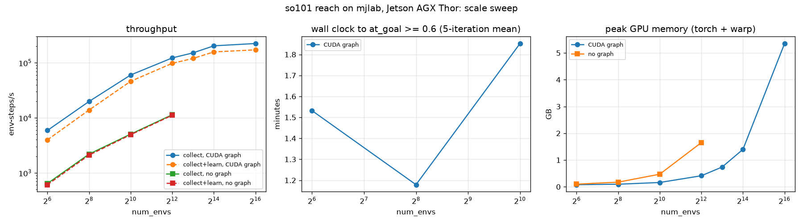

# mjlab extreme use cases

Research examples on the mjlab (MuJoCo Warp) backend and the `rsl_rl` trainer of
strands-robots. Every number in this file was measured on one Jetson AGX Thor
(sm_110, 122 GB unified memory) while two or three sibling jobs shared the GPU,
so absolute throughput is a floor, not a ceiling. Raw json and logs behind each
table are named next to it; a number without a file behind it does not appear here.

Install (two steps, mjlab needs torch>=2.14 while the lerobot extra caps torch lower):

```bash
uv pip install "strands-robots[all]"
uv pip install "strands-robots[sim-mjlab,rl]"
export MUJOCO_GL=egl
```

| # | File | Question it answers |
|---|---|---|
| 01 | [`01_scale_sweep.py`](01_scale_sweep.py) | How far does one Thor go: env-steps/s, wall clock to a converged reach policy and GPU memory from 64 to 65,536 worlds, CUDA graph on and off |
| 02 | [`02_every_arm_one_night.py`](02_every_arm_one_night.py) | One reach recipe on every arm in the registry: build, train, export ONNX, evaluate on classic MuJoCo, one table |
| 03 | [`03_humanoid_beyond_velocity.py`](03_humanoid_beyond_velocity.py) | G1 on rough terrain and get-up, evaluated in the native mjlab play env and sim-to-sim on classic MuJoCo |
| 04 | [`04_extreme_domain_randomisation.py`](04_extreme_domain_randomisation.py) | Per-world physics randomisation pushed to the edge, judged on a perturbation grid the policy never saw |
| 05 | [`05_curriculum_goal_box.py`](05_curriculum_goal_box.py) | Per-world curriculum: each world grows its own goal box (1x to 3x) as it succeeds; does it beat a fixed box at equal iterations |
| 06 | [`06_agent_trains_a_fleet.py`](06_agent_trains_a_fleet.py) | A Strands agent with train_policy / evaluate_policy / write_leaderboard tools trains three arms on its own and writes the leaderboard |
| 07 | [`07_dataset_factory.py`](07_dataset_factory.py) | LeRobot v3 episodes per hour from 1,024 worlds with a scripted expert and with a trained actor |

Helper scripts from the backend lane live next to them (`sim2sim_reach.py`,
`sim2sim_g1_velocity.py`, `vec_eval_bench.py`, `train_then_deploy_*.py`,
`push_run_to_hf.py`).

## 01 Scale sweep

so101 reach task (`strands_robots.training.mjlab_tasks.so101_reach`), PPO through
`MjlabOnPolicyRunner`, 24 steps per env per iteration, seed 42, `at_goal` is the
fraction of worlds with the gripper within 3 cm of the target at the end of an
episode (5-iteration mean must reach 0.6). Data: [`assets/scale_sweep.json`](assets/scale_sweep.json),
plot: [`assets/scale_sweep.png`](assets/scale_sweep.png).



| num_envs | CUDA graph | iterations | collect env-steps/s | collect+learn env-steps/s | at_goal >= 0.6 | wall clock to it | peak GPU GB (torch + warp) |
|---|---|---|---|---|---|---|---|
| 64 | on | 250 | 5,910 | 3,985 | it 249 | 92 s | 0.08 |
| 64 | off | 100 | 642 | 611 | not in 100 its (final 0.00) | - | 0.10 |
| 256 | on | 158 | 19,857 | 13,879 | it 157 | 71 s | 0.10 |
| 256 | off | 100 | 2,196 | 2,105 | not in 100 its (final 0.17) | - | 0.17 |
| 1,024 | on | 201 | 60,112 | 46,169 | it 200 | 111 s | 0.16 |
| 1,024 | off | 100 | 5,068 | 4,939 | not in 100 its (final 0.03) | - | 0.47 |
| 4,096 | on | 300 | 122,834 | 97,882 | not in 300 its (final 0.43) | - | 0.41 |
| 4,096 | off | 20 | 11,410 | 11,166 | not in 20 its (final 0.00) | - | 1.65 |
| 8,192 | on | 300 | 151,790 | 120,228 | not in 300 its (final 0.38) | - | 0.74 |
| 16,384 | on | 300 | 203,573 | 157,815 | not in 300 its (final 0.35) | - | 1.40 |
| 65,536 | on | 20 | 224,336 | 172,147 | not in 20 its (final 0.00) | - | 5.35 |

What the table says:

- Collection throughput keeps climbing to 224k env-steps/s at 65,536 worlds and
  the whole scene fits in 3.5 GB; 262,144 worlds failed to allocate 10 GB while a
  CI runner held about 100 GB of the shared memory, so the true ceiling on Thor
  was not reproduced.
- CUDA graphs are the difference between a GPU simulator and a launch-bound one:
  graphs off is 9 to 12x slower at every size and the GPU sits at 3 to 5 percent
  busy. Runs without graphs at 4,096 and above were cut to 20 iterations; they
  would take hours and teach nothing new.
- More worlds buy samples per second, not fewer PPO updates: 256 and 1,024 worlds
  converge in about 200 iterations (71 s and 111 s), 4,096 and above do not
  converge in 300 iterations with the same hyperparameters (the reach
  hyperparameters were tuned at 1,024). Scaling past 1,024 needs a learning-rate
  and batch schedule to match, which is a research question, not a switch.
- 64 worlds converge too (92 s), but only with the graph on; at that size the
  CPU MuJoCo backend of strands-robots is faster (see the backend REPORT).

## 02 Every arm, one night

Results follow (running).

## 03 Humanoid beyond velocity

Results follow (running).

## 04 Extreme domain randomisation

Two so101 reach actors, same recipe (N=1,024, 300 iterations, seed 42): `none` on
the stock task (591 s) and `extreme` with every physics term redrawn per world on
every reset (958 s; kp and kd x0.4 to x1.8, effort x0.4 to x1.0, body mass x0.5
to x2.0, friction 0.1 to 2.0, joint damping x0.3 to x4.0, encoder bias +/-50
mrad, observation noise x3). Both are then judged on classic MuJoCo (a backend
neither saw), 20 targets, seed 7, 200 ticks at 50 Hz, success = final tcp error
under 3 cm, one fresh model per episode so perturbations never stack. Data:
[`assets/dr_eval.json`](assets/dr_eval.json).

| perturbation (classic MuJoCo, unseen) | nominal success | dr success | nominal median err mm | dr median err mm |
|---|---|---|---|---|
| nominal | 12/20 | 11/20 | 13 | 19 |
| payload_100g | 12/20 | 12/20 | 13 | 19 |
| payload_250g | 12/20 | 12/20 | 13 | 19 |
| mass_x2 | 12/20 | 12/20 | 13 | 19 |
| friction_0.1 | 12/20 | 11/20 | 13 | 19 |
| kp_x0.5 | 12/20 | 12/20 | 13 | 19 |
| kp_x1.8 | 12/20 | 11/20 | 12 | 19 |
| damping_x4 | 12/20 | 11/20 | 13 | 19 |
| everything | 12/20 | 12/20 | 12 | 19 |
| encoder_bias_50mrad | 7/20 | 9/20 | 35 | 32 |
| encoder_bias_100mrad | 0/20 | 1/20 | 62 | 54 |
| obs_noise_20mrad | 12/20 | 11/20 | 14 | 19 |
| action_delay_2 | 1/20 | 4/20 | 58 | 46 |
| action_delay_5 | 0/20 | 0/20 | 160 | 146 |
| hostile | 3/20 | 5/20 | 48 | 49 |

- **Physics perturbations do not separate the actors.** Nine cells, one number:
  12/20 for `none` in every one, 11 or 12 for `extreme`. The same eight targets
  fail in every cell, with final errors of 48 to 144 mm and no approach at all
  (min error equals final error): they are outside what 300 iterations taught,
  not victims of the perturbation. The perturbations are real (a 250 g payload
  sags the held pose by 21 to 31 mrad, kp x0.5 by 5 to 20 mrad, measured on the
  stepped model), but an actor that observes joint positions and `ee_to_target`
  every 20 ms integrates a static sag away within a few ticks.
- **Extreme DR costs precision and buys nothing here.** On the successful
  episodes `extreme` lands at 9.4 mm median, `none` at 10.7 mm, but its
  distribution has a longer tail (19 mm vs 13 mm over all 20), and it needed
  62 % more wall clock for the same iterations (`set_const` per world after
  every reset).
- **What breaks a closed loop is the loop.** The second wave attacks the
  observation and the timing instead of the body: a constant 50 mrad encoder
  bias (inside the DR training range) drops `none` to 7/20 and `extreme` to
  9/20; 100 mrad kills both. Two ticks of action latency (40 ms) take `none`
  to 1/20 and `extreme` to 4/20, and the failures there pass *through* the
  target (min error 3 to 9 mm) and oscillate, the signature of a controller
  tuned for zero latency. Five ticks is 0/20 for both. Gaussian observation
  noise of 20 mrad per tick changes nothing (12/20 vs 11/20): noise averages
  out, bias and delay do not.
- **So the honest thesis is narrower than the title.** Per-world physics DR at
  this scale is cheap to run (1,024 different robots in one `step`) and the
  trained actor is a little more tolerant of encoder bias and latency, which it
  never saw explicitly. If sim-to-real is the goal, randomise the things the
  grid shows matter: observation bias, action delay and, with those, the
  gains; body mass and friction can stay nominal for a position-controlled
  reach. The delay term is the one missing from `EXTREME` today.


## 05 Curriculum goal box

`05_curriculum_goal_box.py` keeps a level per world. Every world starts with the so101 recipe's 1x goal box
(0.12..0.30 x -0.20..0.20 x 0.08..0.30 m in the base frame) and is promoted one level (1.5x, 2x, 2.5x, 3x the box
around its centre) when it reaches its target, demoted when it misses badly; the command term resamples inside the
world's current box. Training: 400 iterations, 1,024 worlds, 1,040 s on the shared GPU. Evaluation: classic MuJoCo,
20 targets per box drawn from that box, 200 ticks at 50 Hz, success within 30 mm, same seed for both actors.

| goal box | reachable targets | curriculum success | baseline_1x success | curriculum median err mm | baseline_1x median err mm |
|---|---|---|---|---|---|
| x1.0 | 0.95 | 18/20 | 18/20 | 10 | 10 |
| x1.5 | 0.75 | 10/20 | 9/20 | 31 | 45 |
| x2.0 | 0.70 | 11/20 | 8/20 | 28 | 41 |
| x2.5 | 0.50 | 9/20 | 6/20 | 70 | 106 |
| x3.0 | 0.60 | 6/20 | 3/20 | 103 | 120 |

`baseline_1x` is the `reach_none` actor from 04 (300 iterations, 1x box only). "reachable targets" is the fraction
of the 20 sampled targets that FK says the arm can reach at all (the 3x box pokes 0.6 m out of a 0.4 m arm), so
it is the ceiling for both rows.

How the population moved (worlds per level, from `curriculum_schedule.json`):

| iteration | mean level | worlds at 1x / 1.5x / 2x / 2.5x / 3x | at_goal at 1x / 3x |
|---|---|---|---|
| 100 | 0.09 | 932 / 90 / 2 / 0 / 0 | 0.10 / - |
| 200 | 0.90 | 343 / 462 / 195 / 24 / 0 | 0.56 / - |
| 300 | 1.87 | 100 / 290 / 351 / 207 / 76 | 0.67 / 0.16 |
| 399 | 2.21 | 51 / 215 / 355 / 279 / 124 | 0.63 / 0.18 |

Reading it honestly: inside the box both actors were trained for, they tie (18/20, 10 mm). Outside it the
curriculum actor wins every stage (10 vs 9, 11 vs 8, 9 vs 6, 6 vs 3; 36/80 vs 26/80 across the four wider boxes)
and its median error is 30 to 35 percent lower, but it also had 100 more iterations and never saw the 3x box for
most of training (the first world got there at iteration 250). The curriculum is a cheap way to widen the
workspace a fixed recipe covers; it is not a substitute for a recipe designed for the wider box.

## 06 Agent trains a fleet

Results follow (queued).

## 07 Dataset factory

Results follow (queued).
