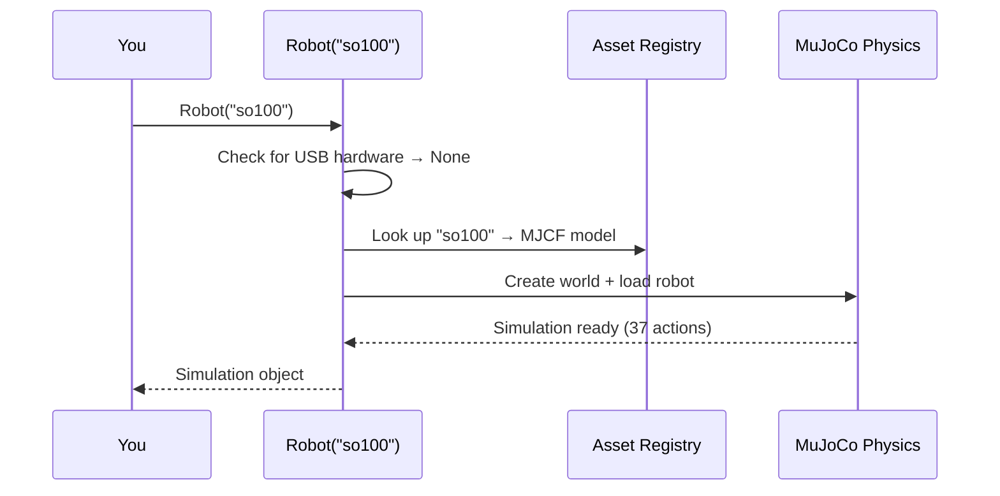

# Sample 01: Hello Robot — Your First Simulation

**Level:** 🟢 Elementary | **Time:** 10 minutes | **Hardware:** CPU only

---

## What You'll Learn

1. Create a simulated robot in **1 line of code**
2. How the `Robot()` factory pattern works (auto-detection)
3. Run a mock policy to see a robot move
4. Render the scene as a PNG image
5. Record a video of robot motion
6. Try different robot types (arms, humanoids, quadrupeds)

## Prerequisites

```bash
pip install strands-robots[sim]
```

No GPU, no API keys, no accounts needed.

## Quick Start

```bash
python hello_robot.py
```

## Concepts

### The One-Line Robot

```python
from strands_robots import Robot
sim = Robot("so100")  # That's it!
```

Behind the scenes:



### The Factory Decision Tree

```mermaid
graph TD
    A["Robot('so100')"] --> B{Hardware detected?}
    B -->|No| C{Which backend?}
    B -->|Yes| D[HardwareRobot]
    C -->|mujoco| E["Simulation (CPU)"]
    C -->|isaac| F["IsaacSimBackend (GPU)"]
    C -->|newton| G["NewtonBackend (GPU)"]

    style A fill:#2196F3,color:#fff
    style E fill:#4CAF50,color:#fff
    style F fill:#FF9800,color:#fff
    style G fill:#9C27B0,color:#fff
    style D fill:#F44336,color:#fff
```



### 5 Core Actions

| Action | What It Does |
|--------|-------------|
| `sim.list_robots()` | See what robots are in the world |
| `sim.run_policy(robot_name, policy_provider)` | Make the robot move |
| `sim.render()` | Capture the scene as a PNG image |
| `sim.record_video(...)` | Record policy execution as MP4 |
| `sim.get_state()` | Inspect simulation state (joints, time, physics) |

### Robot Gallery

| Robot | Type | DOF | Fun Fact |
|-------|------|-----|----------|
| `so100` | Arm | 6 | Low-cost tabletop arm, great for learning |
| `panda` | Arm | 7 | Industrial arm used in thousands of labs |
| `aloha` | Bimanual | 14 | Two arms working together |
| `unitree_g1` | Humanoid | 29 | Full humanoid that walks and manipulates |
| `unitree_go2` | Quadruped | 12 | Four-legged robot dog |
| `reachy_mini` | Head | 6 | Expressive Stewart-platform head |

## Files

| File | Description |
|------|-------------|
| `hello_robot.py` | Main script — create, move, render, record |
| `try_all_robots.py` | Render 6 different robot types |
| `solutions/exercises.py` | Exercise solutions |

## Exercises

### 1. 🟢 Beginner: Render a Panda
Create a `Robot("panda")` and save a render to `panda.png`.

### 2. 🟡 Intermediate: Robot Videos
Record 2-second videos of 3 different robots using `record_video()`.

### 3. 🟠 Challenge: State Comparison
Use `get_state()` to print the simulation state before and after running a policy. What changed?

## SDK Surface Covered

| Class/Function | Module | Purpose |
|---------------|--------|---------|
| `Robot()` | `strands_robots.factory` | Create sim or real robot |
| `Simulation.list_robots()` | `strands_robots.simulation` | Show robots in world |
| `Simulation.run_policy()` | `strands_robots.simulation` | Execute policy in sim |
| `Simulation.render()` | `strands_robots.simulation` | Capture scene as PNG |
| `Simulation.record_video()` | `strands_robots.simulation` | Record policy as MP4 |
| `Simulation.get_state()` | `strands_robots.simulation` | Read simulation state |
| `MockPolicy` | `strands_robots.policies` | Sine-wave demo policy |

## What's Next?

**→ [Sample 02: Policy Playground](../02_policy_playground/)** — Now that you've seen `mock`, learn about real policies and the 17+ providers available.
