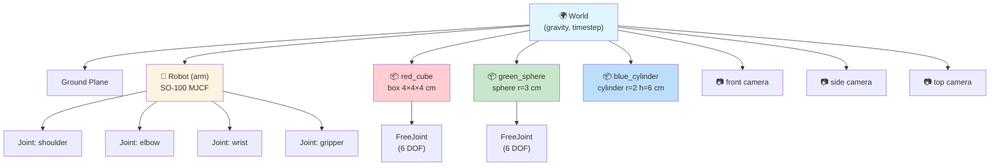
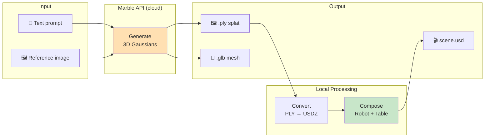
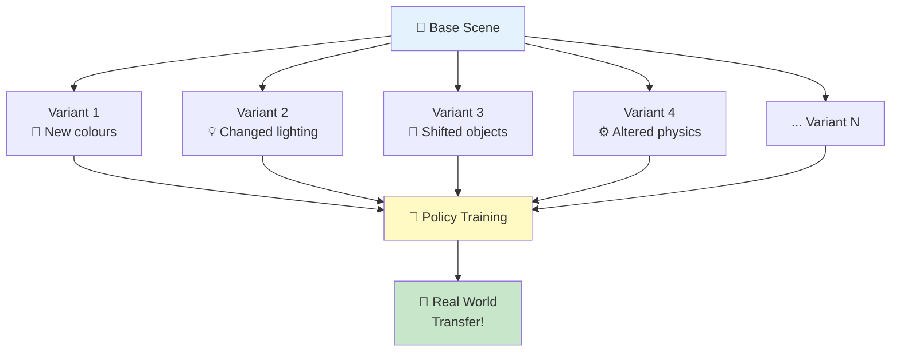

# 🏗️ Sample 03: Build a World — 3D Environment Generation

**Level:** 2 (Middle School) | **Time:** 20 minutes | **Hardware:** CPU (GPU optional for Marble API)

> *"The robot needs somewhere to learn. In this sample, you become the world designer."*

---

## 🎯 Learning Objectives

By the end of this sample, you will be able to:

1. **Create** custom simulation worlds programmatically with `Simulation`
2. **Add** objects (boxes, spheres, cylinders, meshes) to build tabletop scenes
3. **Position** cameras and render from multiple viewpoints
4. **Generate** 3D worlds from text descriptions with **Marble** (World Labs)
5. **Apply** domain randomization (colours, lighting, physics, positions)
6. **Compose** robots + objects + worlds into training environments

## 📋 Prerequisites

| Requirement | Install |
|---|---|
| Samples 01–02 completed | — |
| Simulation backend | `pip install strands-robots[sim]` |
| Marble integration (optional) | `pip install strands-robots[marble]` + set `WLT_API_KEY` |

## 🧠 Core Concepts

### The Scene Graph

Every MuJoCo simulation is a **scene graph** — a tree of bodies, joints, and
geometry primitives. The `Simulation` class lets you build this graph
programmatically, one call at a time:



### Simulation API — Key Methods

The `Simulation` class provides 37+ actions. For world building:

| Method | Signature | What It Does |
|--------|-----------|-------------|
| `create_world()` | `(timestep=0.002, gravity=[0,0,-9.81], ground_plane=True)` | Initialise physics world |
| `add_robot()` | `(name, urdf_path=None, data_config=None, position=None)` | Load robot from registry or path |
| `add_object()` | `(name, shape, position, size, color, mass, is_static)` | Spawn a primitive or mesh |
| `add_camera()` | `(name, position, target, fov, width, height)` | Place a virtual camera |
| `render()` | `(camera_name, width, height)` → base64 PNG | Capture the scene |
| `step()` | `(n_steps)` | Advance physics simulation |
| `randomize()` | `(randomize_colors, randomize_lighting, randomize_physics, ...)` | Apply domain randomization |
| `get_state()` | `()` | Inspect world state |

### The Marble Pipeline: Text → 3D World

[Marble](https://marble.worldlabs.ai) by World Labs generates full 3D
environments from natural language. The `MarblePipeline` class integrates
this into strands-robots:



**8 built-in presets:** `kitchen` · `office_desk` · `workshop` · `living_room` ·
`warehouse` · `lab_bench` · `outdoor_garden` · `restaurant`

### Domain Randomization

Training a policy in one fixed scene creates a **brittle** policy that memorises
pixel-level features. Domain randomization introduces controlled variation:



> **Rule of thumb:** If your policy succeeds across 1000 random variants in
> simulation, it will likely work on the real table.

## 💻 Scripts

### 1. `build_world.py` — Programmatic World Creation

Creates a tabletop manipulation scene step by step:

1. Create physics world (gravity = −9.81 m/s², timestep = 2 ms)
2. Add an SO-100 robot arm
3. Spawn 5 coloured objects (cubes, spheres, cylinder)
4. Mount 3 cameras (front, side, top-down)
5. Render the scene from each camera

```bash
python samples/03_build_a_world/build_world.py
# Output: samples/03_build_a_world/output/world_{front,side,top}.png
```

### 2. `domain_randomization.py` — Scene Variation for Training

Generates a baseline plus 10 randomised variants of the same scene:

- Colours (random RGB per geom, range 0.1–1.0)
- Lighting (position ± 0.5 m, intensity 0.3–1.0)
- Physics (friction × 0.5–1.5, mass × 0.8–1.2) every 3rd variant
- Positions (± 2 cm noise) every 2nd variant

```bash
python samples/03_build_a_world/domain_randomization.py
# Output: randomized_000_baseline.png through randomized_010.png
```

### 3. `marble_world.py` — Text-to-3D World Generation

Demonstrates the Marble pipeline end-to-end:

- Lists all 8 presets with descriptions
- Configures a `MarblePipeline` with `MarbleConfig`
- Generates a kitchen from a text prompt (if `WLT_API_KEY` is set)
- Composes the scene with an SO-101 robot
- Falls back gracefully without an API key

```bash
# Full demo (with API key):
WLT_API_KEY=your_key python samples/03_build_a_world/marble_world.py

# Exploration mode (no key needed):
python samples/03_build_a_world/marble_world.py
```

## 🏋️ Exercises

1. **Dual-Arm Setup:** Build a scene with 2 robot arms facing each other
   (positions `[-0.3, 0, 0]` and `[0.3, 0, 0]`). Place 3 objects between
   them and render from an overhead camera.

2. **Camera Sweep:** Position cameras at 0°, 45°, 90°, 135°, and 180°
   around a scene at the same distance. Render all 5 views.

3. **Randomisation Grid:** Generate 20 domain-randomised variants and
   create a 4×5 collage. Observe how visual diversity grows with each
   randomisation parameter.

4. **Marble Exploration** *(requires API key)*: Generate a `workshop`
   and a `lab_bench` scene. Compose each with a `panda` robot. Compare
   the resulting USD files.

## 📸 Pre-Generated Outputs

If you don't have MuJoCo or a Marble API key, check the pre-generated
outputs in `presentation/output/10_marble_kitchen/` for reference.

## 🔗 What's Next

| Next Sample | Connection |
|---|---|
| [04: Gymnasium Training](../04_gymnasium_training/) | Wrap these worlds as `gymnasium.Env` for RL |
| [06: Ray-Traced Training](../06_raytraced_training/) | Render these scenes with RTX in Isaac Sim |
| [08: Sim-to-Real Transfer](../08_sim_to_real/) | Bridge sim → real via Cosmos Transfer |

## 📚 References

- [Simulation API docs](https://cagataycali.github.io/strands-gtc-nvidia/simulation/)
- [Marble docs](https://cagataycali.github.io/strands-gtc-nvidia/simulation/marble/)
- [Domain Randomization for Sim-to-Real Transfer (Tobin et al., 2017)](https://arxiv.org/abs/1703.06907)
- [Marble by World Labs](https://marble.worldlabs.ai)
- [MuJoCo Documentation](https://mujoco.readthedocs.io/)
